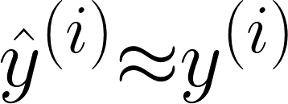
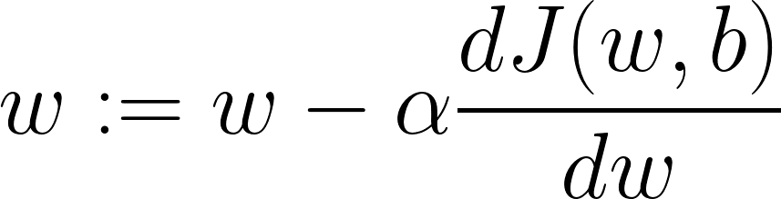
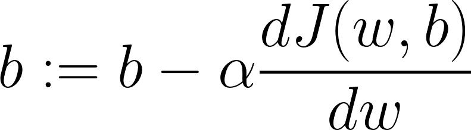

# 🔎 The Problem in General 
Given a dataset like:

$$[(x^{1},y^{1}), (x^{2},y^{2}), ...., (x^{m},y^{m})]$$

We want:

$$\^{y}^{(i)} \approx y^{(i)}$$

## 📚 Basic Concepts and Notations

| Concept         | Description   |
| --------------- |---------------|
| `m`             | Number of examples in dataset |
| $$x^{(i)}$$     | `i`th example in the dataset  |
| `ŷ`             | Predicted output |
| Loss Function `𝓛(ŷ, y)` | A function to compute the error for a **single** training example |
| Cost Function `𝙹(w, b)` | The average of the loss functions of the **entire** training set  |
| Convex Function | A function that has one local value |
| Non-Convex Function | A function that has lots of different local values |
| Gradient Descent | An iterative optimization method that we use to converge to the global optimum of `Cost Function` |

> In other words: The `Cost Function` measures how well our parameters `w` and `b` are doing on the training set, so the best `w` and `b` are the values that minimize `𝙹(w, b)` as possible

## 📉 Gradient Descent
General Formula:

> `α` _(alpha)_ is the **Learning Rate** 

## 🥽 Learning Rate
It is a positive scalar determining the size of the step of each iteration of gradient descent due to the corresponded estimated error each time the model weights are updated, so, it controls how quickly or slowly a neural network model learns a problem.

**Good Learning Rate:**

**Bad Learning Rate:**

## 🧐 References
* [Introduction to Artificial Neural Networks (ANN)](https://searchenterpriseai.techtarget.com/definition/neural-network)
* [More on Learning Rate](https://machinelearningmastery.com/learning-rate-for-deep-learning-neural-networks/)