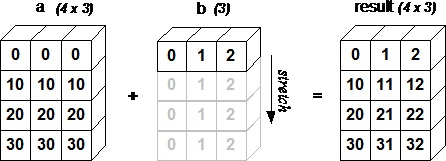

# 👷‍♀️ Notes on Implementation of Neural Networks


## 📚 Common Terms

| Term             | Description   |
| ---------------  |---------------|
| Vectorization    |  A way to speed up the Python code **without using loop** |
| Broadcasting     |  Another technique to make Python code run faster by stretching arrays |
| Rank of an Array |  The number of dimensions it has         |
| Rank 1 Array     |  An array that has only one dimension         |

> A scalar is considered to have rank zero ❗❕

## 🔩 Vectorization
Vectorization is used to speed up the Python _(or Matlab)_ code without using loop. Using such a function can help in minimizing the running time of code efficiently. Various operations are being performed over vector such as _dot product_ of vectors, _outer products_ of vectors and _element wise multiplication_.

### ➕ Advantages
* Faster execution (allows parallel operations) 👨‍🔧
* Simpler and more readable code :sparkles:

### 👀 Simple Visualization


### 👩‍💻 Code Examples:
Finding the _dot product_ of two arrays:

```python
import numpy as np
array1 = np.random.rand(1000)
array2 = np.random.rand(1000)

# not vectorized version
result=0
for i in range(len(array1)):
  result += array1[i] * array2[i]
# result: 244.4311

# vectorized version
v_result = np.dot(array1, array2)
# v_result: 244.4311
``` 

#### 📈 Applying exponential operation on every element of an array (or matrix)

```python
array = np.random.rand(1000)
exp = np.exp(array)
```

#### 🚀 Vectorized version of sigmoid function

```python
array = np.random.rand(1000)
sigmoid = 1 / (1 + np.exp(-array))
```


### 👩‍💻 Common Supported Operations in Numpy

#### 🤸‍♀️ Common single array functions

* Taking the square root of each element in the array
  * `np.sqrt(x)`
* Taking the sum over all of the array's elements
  * `np.sum(x)`
* Taking the absolute value of each element in the array
  * `np.abs(x)`
* Applying **trigonometric** functions on each element in the array
  * `np.sin(x)`, `np.cos(x)`, `np.tan(x)`
* Applying **logarithmic** functions on each element in the array
  * `np.log(x)`, `np.log10(x)`, `np.log2(x)`

#### 🤸‍♂️ Common multiple array functions

* Applying **arithmetic** operations on corresponded elements in the arrays
  * `np.add(x, y)`, `np.subtract(x, y)`, `np.divide(x, y)`, `np.multiply(x, y)`
* Applying **power** operation on corresponded elements in the arrays
  * `np.power(x, y)`

#### ➰ Common sequential functions

* Getting **mean** of an array
  * `np.mean(x)`
* Getting **median** of an array
  * `np.median(x)`
* Getting **variance** of an array
  * `np.var(x)`
* Getting **standart deviation** of an array
  * `np.std(x)`
* Getting **maximum or minimum** value of an array
  * `np.max(x)`, `np.min(x)`
* Getting **index** of maximum or minimum value of an array
  * `np.argmax(x)`, `np.argmin(x)`

## 💉 Broadcasting
The term broadcasting describes how _numpy_ treats arrays with different shapes during arithmetic operations. Subject to certain constraints, the smaller array is **“broadcast”** across the larger array so that they have compatible shapes.

**Practically:**

If you have a matrix **A** that is `(m,n)` and you want to add / subtract / multiply / divide with **B** matrix `(1,n)` matrix then **B** matrix will be copied `m` times into an `(m,n)` matrix and then wanted operation will be applied

Similarly: If you have a matrix **A** that is `(m,n)` and you want to add / subtract / multiply / divide with **B** matrix `(m,1)` matrix then **B** matrix will be copied `n` times into an `(m,n)` matrix and then wanted operation will be applied
 

> Long story short: Arrays (or matrices) with different sizes can not be added, subtracted, or generally be used in arithmetic. So it is a way to make it possible by stretching shapes so they have compatible shapes :sparkles:


### 👀 Simple Visualization


### 👩‍💻 Code Examples:

#### ➕ Adding a (1,n) row vector to a (2,n) matrix

```python
a = np.array([[0, 1, 2], 
              [5, 6, 7]] )
b = np.array([1, 2, 3])
print(a + b)

# Output: [[ 1  3  5]
#          [ 6  8 10]]
``` 

#### ➖ Subtracting <i><b>a</b></i> scalar from a matrix

```python
a = np.array( [[0, 1, 2], 
               [5, 6, 7]] )
c = 2
print(a - c)
# Output: [[-2 -1  0]
#          [ 3  4  5]]
```

## 1️⃣ Rank 1 Array

### 👩‍💻 Code Example

```python
x = np.random.rand(5)
print('shape:', x.shape, 'rank:', x.ndim)

# Output: shape: (5,) rank: 1

y = np.random.rand(5, 1)
print('shape:', y.shape, 'rank:', y.ndim)

# Output: shape: (5, 1) rank: 2

z = np.random.rand(5, 2, 2)
print('shape:', z.shape, 'rank:', z.ndim)

# Output: shape: (5, 2, 2) rank: 3
```

> It is recommended not to use rank 1 arrays

### 🤔 Why it is recommended not to use 1 rank arrays?
Rank 1 arrays may cause bugs that are difficult to find and fix, for example:

Dot operation on rank 1 arrays:
```python
a = np.random.rand(4)
b = np.random.rand(4)
print(a)
print(a.T)
print(np.dot(a,b))

# Output
# [0.40464616 0.46423665 0.26137661 0.07694073]
# [0.40464616 0.46423665 0.26137661 0.07694073]
# 0.354194202098512
```

Dot operation on rank 2 arrays:

```python
a = np.random.rand(4,1)
b = np.random.rand(4,1)
print(a)
print(np.dot(a,b))

# Output
# [[0.68418713]
# [0.53098868]
# [0.16929882]
# [0.62586001]]
# [[0.68418713 0.53098868 0.16929882 0.62586001]]
# ERROR: shapes (4,1) and (4,1) not aligned: 1 (dim 1) != 4 (dim 0)
```

> Conclusion: We have to avoid using rank 1 arrays in order to make our codes more bug-free and easy to debug 🐛

## 🧐 References
* [Official Documentation of Broadcasting in NumPy](https://docs.scipy.org/doc/numpy/user/basics.broadcasting.html)