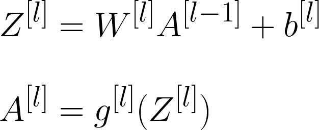
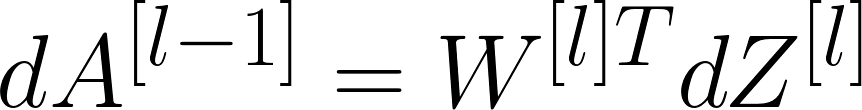

# 📚 Concepts of Artificial Neural Networks

Basic Concepts of ANN

## 🍭 Basic Neural Network

> **Convention:** The NN in the image called to be a 2-layers NN since input layer is not being counted 📢❗

## 📚 Common Terms

| Term             | Description   |
| ---------------  |---------------|
| Input Layer      |  A layer that conatains the inputs to the NN |
| Hidden Layer     |  The layer(s) where computational operations are being done |
| Output Layer     |  The final layer of the NN and it is responsible for generating the predicted value ŷ |
| Neuron           |  A placeholder for a mathematical function, it applies a function on inputs and provides an output |
| Activation Function | A function that converts an input signal of a node to an output signal by applying some transformation |
| Shallow NN       |  NN with few number of hidden layers (one or two)  |
| Deep NN          |  NN with large number of hidden layers |
| n[l]  |  Number of units in _l_ layer |

## 🧠 What does an artificial neuron do?
It calculates a _weighted sum_ of its input, adds a bias and then decides whether it should be _fired_ or not due to an activaiton function
> My detailed notes on activaiton functions are [here](https://github.com/asmaamirkhan/DeepLearningNotes/tree/master/6-NNConcepts/3-ActivationFunctions.md) 👩‍🏫

## 👩‍🔧 Parameters Dimension Control

| Parameter        | Dimension     |
| ---------------  |---------------|
| w[<i>l</i>]   |  (n[<i>l</i>],n[<i>l-1</i>]) |
| b[<i>l</i>]   |  (n[<i>l</i>],1) |
| dw[<i>l</i>]  |  (n[<i>l</i>],n[<i>l-1</i>]) |
| db[<i>l</i>]  |  (n[<i>l</i>],1) |

> Making sure that these dimensions are true help us to write better and bug-free :bug: codes

## 🎈 Summary of Forward Propagation Process

|                  |                 |
| ---------------- | --------------- |
| **Input:**       |  a[<i>l</i>-1] |
| **Output:**      |  a[<i>l</i>], chache (z[<i>l</i>]) |

**Vectorized Equations:**

## 🎈 Summary of Back Propagation Process

|                  |                 |
| ---------------- | --------------- |
| **Input:**       |  da[<i>l</i>] |
| **Output:**      | da[<i>l</i>-1], dW[<i>l</i>], db[<i>l</i>] |

**Vectorized Equations:**

 

 

 

## ➰➰ To Put Forward Prop. and Back Prop. Together

> 😵🤕

## ✨ Parameters vs Hyperparameters

**Parameters:**
* W[<i>1</i>], W[<i>2</i>], W[<i>3</i>]
* b[<i>1</i>], b[<i>2</i>]
* ......

**Hyperparameters:**

* Learning rate
* Number of iterations
* Number of hidden layers
* Number of hidden units
* Choice of activation function
* ......

> We can say that hyperparameters control parameters 🤔