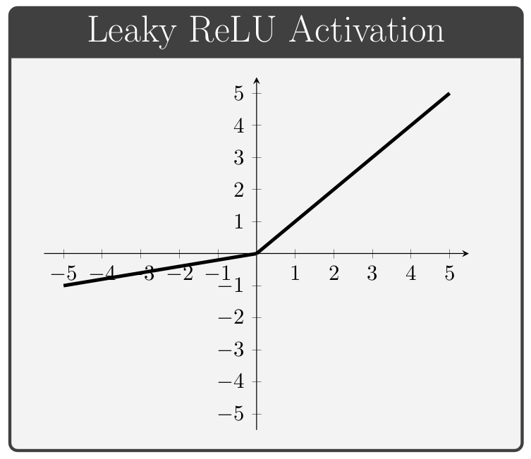

# 💥 Activation Functions in Neural Networks
The main purpose of Activation Functions is to convert an input signal of a node in an ANN to an output signal by applying a transformation. That output signal now is used as a input in the next layer in the stack.

## 📃 Types of Activaiton Functions

| Function                   | Description                                              |
| -------------------------- | -------------------------------------------------------- |
| Linear Activation Function |  Inefficient, used in regression                         |
| Sigmoid Function           |  Good for output layer in binary classification problems |
| Tanh Function              |  Better than sigmoid                                     |
| Relu Function ✨           |  Default choice for hidden layers                        |
| Leaky Relu Function        |  Little bit better than Relu, Relu is more popular       |

### 📈 Linear Activation Function (Identity Function)

**Formula:**

$$linear(x)=x$$

**Graph:**

> It can be used in regression problem in the output layer 

### 🎩 Sigmoid Function

**Formula:**

$$sigmoid(x)=\frac{1}{1+exp(-x)}$$

**Graph:**

### 🎩 Tangent Function

Almost always strictly superior than sigmoid function

**Formula:**

$$tanh(x)=\frac{2}{1+e^{-2x}}-1$$

> Shifted version of the Sigmoid function 🤔

**Graph:**

> Activation functions can be different for different layers, for example, we may use _tanh_ for a hidden layer and _sigmoid_ for the output layer 

### 🙄 Downsides on Tanh and Sigmoid
If z is very large or very small then the derivative _(or the slope)_ of these function becomes very small (ends up being close to 0), and so this can slow down gradient descent 🐢

### 🎩 Rectified Linear Activation Unit (Relu ✨) 
Another and very popular choice

**Formula:**
$$
relu(x)=\left\{\begin{matrix}
0, if x<0
\\
x,if x\geq0
\end{matrix}\right.
$$

**Graph:**

So the derivative is 1 when z is positive and 0 when z is negative
> *Disadvantage:* derivative=0 when z is negative 😐

### 🎩 Leaky Relu

**Formula:**
$$
leaky\_relu(x)=\left\{\begin{matrix}
0.01x, if x<0
\\
x,if x\geq0
\end{matrix}\right.
$$

**Graph:**

**Or:** 😛

### 🎀 Advantages of Relu's
* A lot of the space of z the derivative of the activation function is very different from 0
* NN will learn much faster than when using tanh or sigmoid    

## 🤔 Why Do NNs Need non-linear Activation Functions
Well, if we use linear function then the NN is just outputting a linear function of the input, so no matter how many layers out NN has 🙄, all it is doing is just computing a linear function 😕

> ❗ Remember that the composition of two linear functions is itself a linear function

## 👩‍🏫 Rules For Choosing Activation Function
* If the output is 0 or 1 (binary classification) ➡ *sigmoid* is good for output layer
* For all other units ➡ *Relu* ✨
  
> We can say that relu is the default choice for activation function

Note:

> If you are not sure which one of these functions work best 😵, try them all 🤕 and evaluate on different validation set and see which one works better and go with that 🤓😇

## 🧐 Read More
* [Which Activation Function Should I Use? (Siraj Raval :sparkles:)](https://www.youtube.com/watch?v=-7scQpJT7uo)
* [Activation Functions in Neural Networks](https://towardsdatascience.com/activation-functions-neural-networks-1cbd9f8d91d6)
* [Understanding Activation Functions in Neural Networks](https://medium.com/the-theory-of-everything/understanding-activation-functions-in-neural-networks-9491262884e0)
