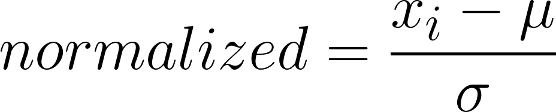
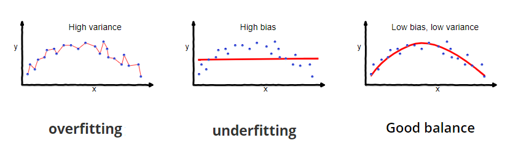

# Practical Aspects of NN Impelemenation

## Data Normalization
It is a part of _data preparation_

If we have a feature that is all positive or all negative, this will make learning harder for the nodes in the layer that follows. They will have to _zigzag_ like the ones following a sigmoid activation function. If we transform our data so it has a mean close to zero, we will thereby make sure that there are both positive values and negative ones.

**Formula:**

> Benifit: It makes cost function _J_ easier and faster to optimize 😋

## Things to think well before implementing NN
Number of layers, number of hidden units, learning rates, activation functions... 

It is too difficult to choose them all true at the first time so it is an iterative process

Idea ➡ Code ➡ Experiment ➡ Idea 🔁

> So the point here is how to go efficiently around this cycle 🤔

## Train / Dev / Test Splitting
For good evaluation it is good to split dataset like the following:

| Part                         | Description                                                                |
| ---------------------------- | -------------------------------------------------------------------------- |
| Training Set                 |  Used to fit the model                                                     |
| Development (Validation) Set |  Used to provide an unbiased evaluation while tuning model hyperparameters |
| Test Set                     |  Used to provide an unbiased evaluation of a **final** model               |

### Training Set
The actual dataset that we use to train the model (weights and biases in the case of Neural Network). 

> The model **sees** and **learns** from this data 👶

### Validation (Development) Set
The sample of data used to provide an unbiased evaluation of a model fit on the training dataset while tuning model hyperparameters. The evaluation becomes more biased as skill on the validation dataset is incorporated into the model configuration.

> The model **sees** this data, but **never learns** from this 👨‍🚀

### Test Set
The sample of data used to provide an unbiased evaluation of a final model fit on the training dataset. It provides the gold standard used to evaluate the model.

**Implementation Note:** Test set should contain carefully sampled data that spans the various classes that the model would face, when used in the real world 🚩🚩🚩❗❗❗

> It is only used once a model is completely trained 👨‍🎓

## Bias / Variance

### Bias
**Bias** is how far are the predicted values from the actual values. If the average predicted values are far off from the actual values then the bias is high.

> Having high-bias implies that the model is too simple and does not capture the complexity of data thus **underfitting** the data 🤕

### Variance
Variance is the variability of model prediction for a given data point or a value which tells us spread of our data
Model with high variance fails to generalize on the data which it hasn’t seen before.

> Having high-variance implies that algorithm models random noise present in the training data and it **overfits** the data 🤓

## Variance / Bias Visualization

## While implementing the model..
If we aren't able to get wanted performance we should ask these questions to improve our model:

> We check the performance of the following solutions on dev set 

1. Do we have high bias? If yes, it is a trainig problem, we may:
   * Try bigger network
   * Train longer
   * Try better optimization algorithm
   * Try another NN architecture
  
> We can say that it is a structural problem 🤔

2. Do we have high variance? If yes, it is a dev set performance problem, we may:
   * Get more data
   * Do regularization
     * L2, dropout, data augmentation
  
> We can say that maybe it is data or algorithmic problem 🤔

3. No high variance and no high bias?

> TADAAA it is done 🤗🎉🎊

## References
* [About Train, Validation and Test Sets in Machine Learning](https://towardsdatascience.com/train-validation-and-test-sets-72cb40cba9e7)
* [Bias and Variance in Machine Learning](https://medium.com/datadriveninvestor/bias-and-variance-in-machine-learning-51fdd38d1f86)