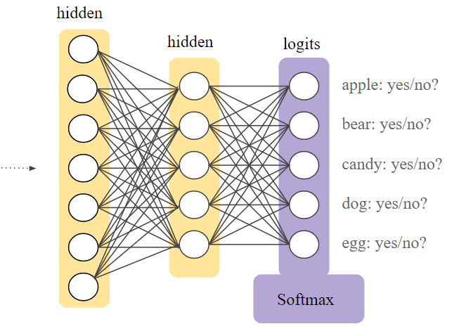

# 🎨 Softmax Regression
**We can learn it by likening it to logistic regression:** 😋

Recall that logistic regression produces a decimal between 0 and 1.0. For example, a logistic regression output of 0.8 from an email classifier suggests an 80% chance of an email being spam and a 20% chance of it being not spam. Clearly, the sum of the probabilities of an email being either spam or not spam is 1.0.

Softmax extends this idea into the **MULTI-CLASS** world. That is, Softmax assigns decimal probabilities to each class in a multi-class problem. **Those decimal probabilities must add up to 1.0**.

* Its other name is _Maximum Entropy (MaxEnt) Classifier_

We can say that softmax regression generalizes logistic regression
> Logistic regression is a special status of softmax where C = 2 🤔

### 📚 Notation
C = number of classes = number of units of the output layer
So,  ŷ<sub>_j_</sub>  is a (C, 1) dimensional vector.

### 🎨 Softmax Layer
Softmax is implemented through a neural network layer just before the output layer. The Softmax layer must have the same number of nodes as the output layer.



### 💥 Softmax Activation Function


### 🔨 Hard max function 
Tekes the output of softmax layer and convert it into _1 vs 0 vector_ (as I called it 🤭) which will be our _ŷ_

For example:
```
t = 0.13  ==> ̂y = 0
    0.75          1
    0.01          0
    0.11          0
```
And so on 🐾

### 🔎 Loss Function


> Y and  ŷ are (C,m) dimensional matrices 👩‍🔧

## 🧐 Read More
* [Long story short from Google documentation](https://developers.google.com/machine-learning/crash-course/multi-class-neural-networks/softmax)