# 👩‍💻 Pyhton Code Snippets on The Basics of Neural Networks

## 📚 General Code Snippets in ML

### 💥 Sigmoid Function





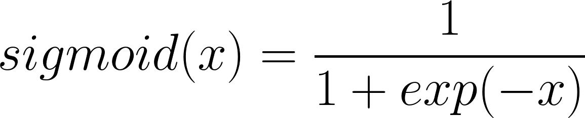





```python
def sigmoid(x):
    """
    Arguments:
    x -- A scalar, an array or a matrix

    Return:
    result -- sigmoid(x)
    """

    result = 1 /( 1 + np.exp(-x) )

    return result
```



### 🚀 Sigmoid Gradient



A function that computes gradients to optimize loss functions using backpropagation





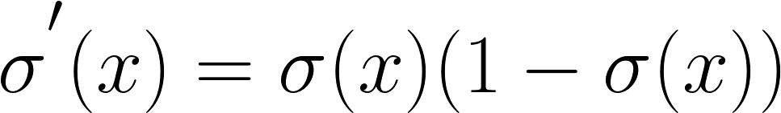





```python
    def sigmoid_derivative(x):
    """
    Computes the gradient (also called the slope or derivative) of the sigmoid function with respect to its input x.

    Arguments:
    x -- A scalar or numpy array

    Return:
    ds -- Your computed gradient.
    """

    s = 1 / (1 + np.exp(-x))
    ds = s * (1 - s)

    return ds
```




### 👩‍🔧 Reshaping Arrays \(or images\)





```python
    def arr2vec(arr, target):
     """
    Argument:
    image -- a numpy array of shape (length, height, depth)

    Returns:
    v -- a vector of shape (length*height*depth, 1)
    """

    v = image.reshape(image.shape[0] * image.shape[1] * image.shape[2], 1)

    return v
```




### 💥 Normalizing Rows



Dividing each row vector of x by its norm.





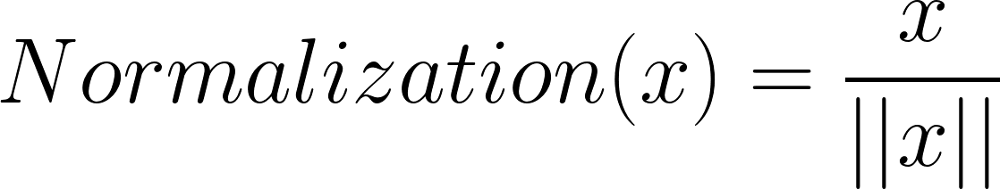





```python
def normalizeRows(x):
    """
    Argument:
    x -- A numpy matrix of shape (n, m)

    Returns:
    x -- The normalized (by row) numpy matrix.
    """

    # Finding norms
    x_norm = np.linalg.norm(x, axis=1, keepdims=True)

    # Dividing x by its norm
    x = x / x_norm

    return x
```



### 🎨 Softmax Function



A normalizing function used when the algorithm needs to classify two or more classes










```python
 def softmax(x):
    """Calculates the softmax for each row of the input x.

    Argument:
    x -- A numpy matrix of shape (n,m)

    Returns:
    s -- A numpy matrix equal to the softmax of x, of shape (n,m)
    """

    # Applying exp() element-wise to x
    x_exp = np.exp(x)

    # Creating a vector x_sum that sums each row of x_exp
    x_sum = np.sum(x_exp, axis=1, keepdims=True)

    # Computing softmax(x) by dividing x_exp by x_sum.
    # numpy broadcasting will be used automatically.
    s = x_exp / x_sum

    return s
```



### 🤸‍♀️ L1 Loss Function



The loss is used to evaluate the performance of the model. The bigger the loss is, the more different that predictions \( ŷ \) are from the true values \( y \). In deep learning, we use optimization algorithms like Gradient Descent to train the model and to minimize the cos





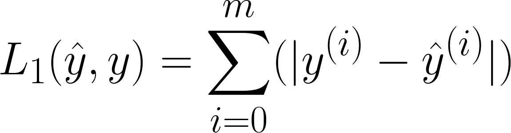





```python
def L1(yhat, y):
    """
    Arguments:
    yhat -- vector of size m (predicted labels)
    y -- vector of size m (true labels)

    Returns:
    loss -- the value of the L1 loss function defined above
    """

    loss = np.sum(np.abs(y - yhat))

    return loss
```



### 🤸‍♂️ L2 Loss Function



 The loss is used to evaluate the performance of the model. The bigger the loss is, the more different that predictions \( ŷ \) are from the true values \( y \). In deep learning, we use optimization algorithms like Gradient Descent to train the model and to minimize the cost.





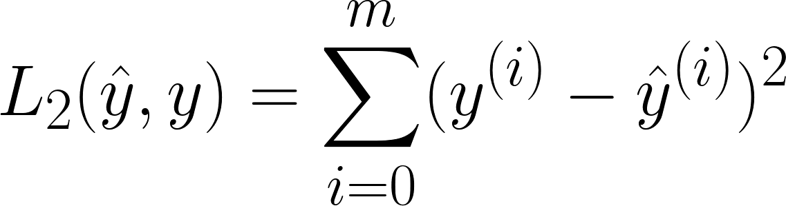





```python
def L2(yhat, y):
    """
    Arguments:
    yhat -- vector of size m (predicted labels)
    y -- vector of size m (true labels)

    Returns:
    loss -- the value of the L2 loss function defined above
    """

    loss = np.sum((y - yhat) ** 2)

    return loss
```



### 🏃‍♀️ Propagation Function



Doing the "forward" and "backward" propagation steps for learning the parameters.



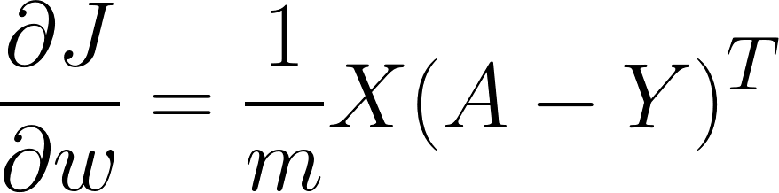

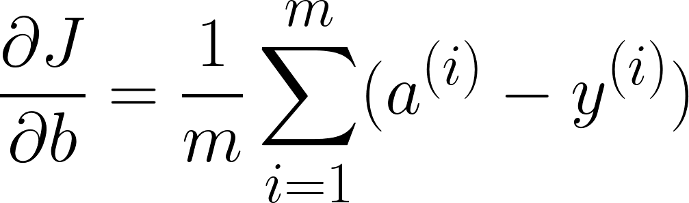





```python
def propagate(w, b, X, Y):
    """
    Implementation of the cost function and its gradient for the propagation

    Arguments:
    w -- weights, a numpy array of size (num_px * num_px * 3, 1)
    b -- bias, a scalar
    X -- data of size (num_px * num_px * 3, number of examples)
    Y -- true "label" vector (containing 0 if non-cat, 1 if cat) of size (1, number of examples)

    Return:
    cost -- negative log-likelihood cost for logistic regression
    dw -- gradient of the loss with respect to w, thus same shape as w
    db -- gradient of the loss with respect to b, thus same shape as b

    """

    m = X.shape[1]

    # FORWARD PROPAGATION (FROM X TO COST)

    # computing activation
    A = sigmoid( np.dot(w.T, X) + b ) 

    # computing cost
    cost = - np.sum( Y * np.log(A) + (1-Y) * np.log(1 - A) ) / m 

    # BACKWARD PROPAGATION (TO FIND GRAD)

    dw = (np.dot(X,(A-Y).T))/m
    db = np.sum(A-Y)/m

    grads = {"dw": dw,
             "db": db}

    return grads, cost
```



### 💫 Gradient Descent \(Optimization\)



The goal is to learn _ω_ and _b_ by minimizing the cost function _J_. For a parameter _ω_





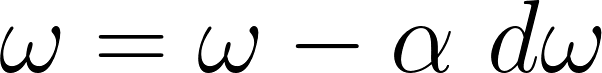





```python
def optimize(w, b, X, Y, num_iterations, learning_rate, print_cost = False):
    """
    This function optimizes w and b by running a gradient descent algorithm

    Arguments:
    w -- weights, a numpy array of size (num_px * num_px * 3, 1)
    b -- bias, a scalar
    X -- data of shape (num_px * num_px * 3, number of examples)
    Y -- true "label" vector (containing 0 if non-cat, 1 if cat), of shape (1, number of examples)
    num_iterations -- number of iterations of the optimization loop
    learning_rate -- learning rate of the gradient descent update rule
    print_cost -- True to print the loss every 100 steps

    Returns:
    params -- dictionary containing the weights w and bias b
    grads -- dictionary containing the gradients of the weights and bias with respect to the cost function
    costs -- list of all the costs computed during the optimization, this will be used to plot the learning curve.
    """

    costs = []

    for i in range(num_iterations):


        # Cost and gradient calculation
        grads, cost = propagate(w, b, X, Y)

        # Retrieve derivatives from grads
        dw = grads["dw"]
        db = grads["db"]

        # update rule
        w = w - learning_rate*dw
        b = b - learning_rate*db

        # Record the costs
        if i % 100 == 0:
            costs.append(cost)

        # Print the cost every 100 training iterations (optional)
        if print_cost and i % 100 == 0:
            print ("Cost after iteration %i: %f" %(i, cost))

    params = {"w": w,
              "b": b}

    grads = {"dw": dw,
             "db": db}

    return params, grads, costs
```



## 🕸 Basic Code Snippets for Simple NN

Functions of 2-layer NN

> Input layer, 1 hidden layer and output layer

### 🚀 Parameter Initialization



Initializing `W`s and `b`s, `W`s must be initialized randomly in order to do **symmetry-breaking**, we can do _zero initalization_ for `b`s





```python
def initialize_parameters(n_x, n_h, n_y):
    """
    Argument:
    n_x -- size of the input layer
    n_h -- size of the hidden layer
    n_y -- size of the output layer

    Returns:
    params -- python dictionary containing your parameters:
                    W1 -- weight matrix of shape (n_h, n_x)
                    b1 -- bias vector of shape (n_h, 1)
                    W2 -- weight matrix of shape (n_y, n_h)
                    b2 -- bias vector of shape (n_y, 1)
    """
    # multiplying with 0.01 to minimize values
    W1 = np.random.randn(n_h,n_x) * 0.01
    b1 = np.zeros((n_h,1))
    W2 = np.random.randn(n_y,n_h) * 0.01
    b2 = np.zeros((n_y,1))

    parameters = {"W1": W1,
                  "b1": b1,
                  "W2": W2,
                  "b2": b2}

    return parameters
```



### ⏩ Forward Propagation



Each layer accepts the input data, processes it as per the activation function and passes to the next layer





```python
def forward_propagation(X, parameters):
    """
    Argument:
    X -- input data of size (n_x, m)
    parameters -- python dictionary containing your parameters (output of initialization function)

    Returns:
    A2 -- The sigmoid output of the second activation
    cache -- a dictionary containing "Z1", "A1", "Z2" and "A2"
    """

    # Retrieving each parameter from the dictionary "parameters"
    W1 = parameters['W1']
    b1 = parameters['b1']
    W2 = parameters['W2']
    b2 = parameters['b2']

    Z1 = np.dot(W1, X) + b1
    A1 = np.tanh(Z1)
    Z2 = np.dot(W2, A1) + b2
    A2 = sigmoid(Z2)

    cache = {"Z1": Z1,
             "A1": A1,
             "Z2": Z2,
             "A2": A2}

    return A2, cache
```



### 🚩 Cost Function



 The average of the loss functions of the **entire** training set due to the output layer -_from A2 in our example_-





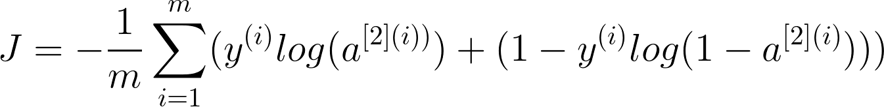





```python
def compute_cost(A2, Y):
    """
    Computes the cross-entropy cost given in equation (13)

    Arguments:
    A2 -- The sigmoid output of the second activation, of shape (1, number of examples)
    Y -- "true" labels vector of shape (1, number of examples)   

    Returns:
    cost -- cross-entropy cost given equation (13)

    """

    # Number of examples
    m = Y.shape[1] 

    # Computing the cross-entropy cost
    logprobs = np.multiply(np.log(A2), Y) + (1 - Y) * np.log(1 - A2)
    cost = - np.sum(logprobs) / m
    cost = float(np.squeeze(cost))  

    return cost
```



### ⏪ Back Propagation



Proper tuning of the weights ensures lower error rates, making the model reliable by increasing its generalization.





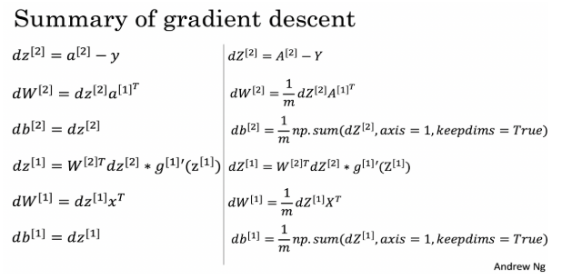





```python
def backward_propagation(parameters, cache, X, Y):
    """
    Implement the backward propagation using the instructions above.

    Arguments:
    parameters -- python dictionary containing our parameters 
    cache -- a dictionary containing "Z1", "A1", "Z2" and "A2".
    X -- input data of shape (2, number of examples)
    Y -- "true" labels vector of shape (1, number of examples)

    Returns:
    grads -- python dictionary containing your gradients with respect to different parameters
    """
    m = X.shape[1]

    # Retrieving W1 and W2 from the dictionary "parameters".
    W1 = parameters['W1']
    W2 = parameters['W2']

    # Retrieving also A1 and A2 from dictionary "cache".
    A1 = cache['A1']
    A2 = cache['A2']

    # Backward propagation: calculating dW1, db1, dW2, db2. 
    dZ2 = A2 - Y
    dW2 = np.dot(dZ2, A1.T) / m
    db2 = np.sum(dZ2, axis = 1, keepdims = True) / m
    dZ1 = np.dot(W2.T, dZ2) * (1 - A1 ** 2)
    dW1 = np.dot(dZ1, X.T) / m
    db1 = np.sum(dZ1, axis = 1, keepdims = True) / m

    grads = {"dW1": dW1,
             "db1": db1,
             "dW2": dW2,
             "db2": db2}

    return grads
```



### 🔃 Updating Parameters



Updating the parameters due to the learning rate to complete the gradient descent





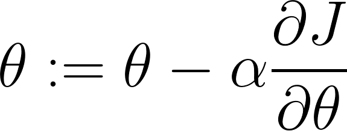





```python
def update_parameters(parameters, grads, learning_rate = 1.2):
    """
    Updates parameters using the gradient descent update rule given above

    Arguments:
    parameters -- python dictionary containing your parameters 
    grads -- python dictionary containing your gradients 

    Returns:
    parameters -- python dictionary containing your updated parameters 
    """
    # Retrieving each parameter from the dictionary "parameters"
    W1 = parameters['W1']
    b1 = parameters['b1']
    W2 = parameters['W2']
    b2 = parameters['b2']

    # Retrieving each gradient from the dictionary "grads"
    dW1 = grads['dW1']
    db1 = grads['db1']
    dW2 = grads['dW2']
    db2 = grads['db2']

    # Updating rule for each parameter
    W1 = W1 - learning_rate * dW1
    b1 = b1 - learning_rate * db1
    W2 = W2 - learning_rate * dW2
    b2 = b2 - learning_rate * db2

    parameters = {"W1": W1,
                  "b1": b1,
                  "W2": W2,
                  "b2": b2}

    return parameters
```


