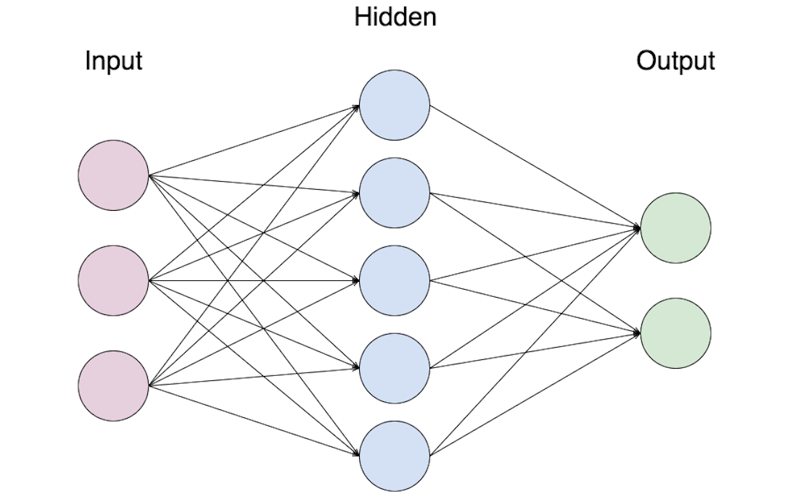
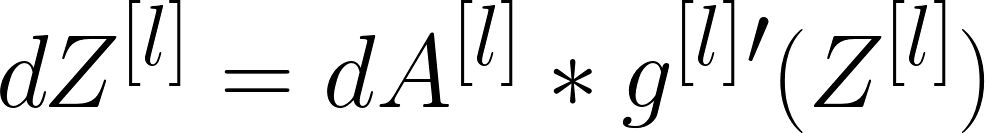

# 📚 Concepts of Artificial Neural Networks

Basic Concepts of ANN

## 🍭 Basic Neural Network

> **Convention:** The NN in the image called to be a 2-layers NN since input layer is not being counted 📢❗

## 📚 Common Terms

| Term | Description |
| :--- | :--- |
| Input Layer | A layer that contains the inputs to the NN |
| Hidden Layer | The layer\(s\) where computational operations are being done |
| Output Layer | The final layer of the NN and it is responsible for generating the predicted value ŷ |
| Neuron | A placeholder for a mathematical function, it applies a function on inputs and provides an output |
| Activation Function | A function that converts an input signal of a node to an output signal by applying some transformation |
| Shallow NN | NN with few number of hidden layers \(one or two\) |
| Deep NN | NN with large number of hidden layers |
| n\[l\] | Number of units in _l_ layer |

## 🧠 What does an artificial neuron do?

It calculates a _weighted sum_ of its input, adds a bias and then decides whether it should be _fired_ or not due to an activaiton function

> My detailed notes on activation functions are [here](https://github.com/asmaamirkhan/DeepLearningNotes/tree/master/6-NNConcepts/3-ActivationFunctions.md) 👩‍🏫

## 👩‍🔧 Parameters Dimension Control

| Parameter | Dimension |
| :--- | :--- |
| w\[l\] | \(n\[l\],n\[l-1\]\) |
| b\[l\] | \(n\[l\],1\) |
| dw\[l\] | \(n\[l\],n\[l-1\]\) |
| db\[l\] | \(n\[l\],1\) |

> Making sure that these dimensions are true help us to write better and bug-free :bug: codes

## 🎈 Summary of Forward Propagation Process

|  |  |
| :--- | :--- |
| **Input:** | a\[l-1\] |
| **Output:** | a\[l\], chache \(z\[l\]\) |

**Vectorized Equations:**

## 🎈 Summary of Back Propagation Process

|  |  |
| :--- | :--- |
| **Input:** | da\[l\] |
| **Output:** | da\[l-1\], dW\[l\], db\[l\] |

**Vectorized Equations:**

   
    
    
 

## ➰➰ To Put Forward Prop. and Back Prop. Together

> 😵🤕

## ✨ Parameters vs Hyperparameters

**Parameters:**

* W\[1\], W\[2\], W\[3\]
* b\[1\], b\[2\]
* ......

**Hyperparameters:**

* Learning rate
* Number of iterations
* Number of hidden layers
* Number of hidden units
* Choice of activation function
* ......

> We can say that hyperparameters control parameters 🤔

