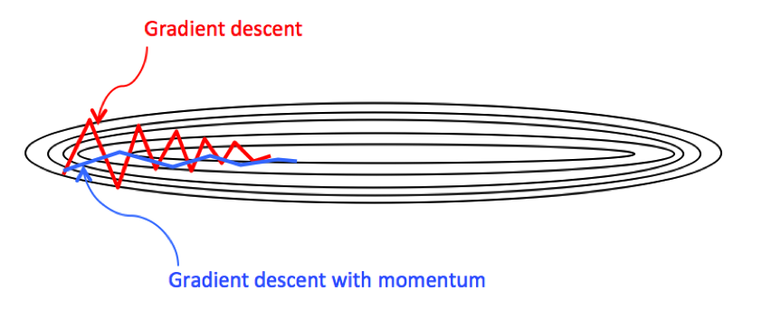

# ✨ Optimization Algorithms

Having fast and good optimization algorithms can speed up the efficiency of the whole work ✨

## 🔩 Batch Gradient Descent

In batch gradient we use the **entire** dataset to compute the gradient of the cost function for each iteration of the gradient descent and then update the weights.

* Since we use the entire dataset to compute the gradient convergence is slow.

### 🎩 Stochastic Gradient Descent \(SGD\)

In stochastic gradient descent we use a single datapoint or example to calculate the gradient and update the weights with **every** iteration, we first need to shuffle the dataset so that we get a completely randomized dataset.

Random sample helps to arrive at a global minima and avoids getting stuck at a local minima.

* Learning is much faster and convergence is quick for a very large dataset 🚀

### 🔩 Mini Batch Gradient Descent

* Mini-batch gradient is a variation of stochastic gradient descent where instead of single training example, mini-batch of samples is used.
* Mini batch gradient descent is widely used and converges faster and is more stable.
* Batch size can vary depending on the dataset.

> 1 ≤ batch-size ≤ m, batch-size is a hyperparameter ❗

### 🔃 Comparison

* Very large batch-size \(m or close to m\): 
  * Too long per iteration
* Very small batch-size \(1 or close to 1\)
  * losing speed up of vectorization
* Not batch-size too large/small
  * We can do vectorization
  * Good speed per iteration
  * The fastest \(best\) learning 🤗✨   

### 🚩 Guidelines for Choosing Batch-Size

* For a small \(m ≤ 2000\) dataset ➡ use batch gradient descent
* Typical mini batch-size: 64, 128, 256, 512, up to 1024
* Make sure mini batch-size fits in your CPU/GPU memory 

> It is better\(faster\) to choose mini batch size as a power of 2 \(due to memory issues\) 🧐

## 🔩 Gradient Descent with Momentum

Almost always, gradient descent with momentum converges **faster** ✨ than the standard gradient descent algorithm. In the standard gradient descent algorithm, we take larger steps in one direction and smaller steps in another direction which slows down the algorithm. 🤕

This is what momentum can improve, it restricts the oscillation in one direction so that our algorithm can converge faster. Also, since the number of steps taken in the y-direction is restricted, we can set a higher learning rate. 🤗

The following image describes better: 🧐

**Formula:**

$$v_{dW} = \beta v_{dW }+ (1-\beta)dW$$

$$v_{db} = \beta v_{db }+ (1-\beta)db$$

$$W = W -\alpha v_{dW}$$

$$b = b -\alpha v_{db}$$

For better understanding:

In gradient descent with momentum, while we are trying to speed up gradient descent we can say that:

* Derivatives are the accelerator
* v's are the velocity
* _β_ is the friction

## 🔩 RMSprop Optimizer

The RMSprop optimizer is similar to the gradient descent algorithm with momentum. The RMSprop optimizer restricts the oscillations in the vertical direction. Therefore, we can increase our learning rate and our algorithm could take larger steps in the horizontal direction converging faster.

The difference between RMSprop and gradient descent is on how the gradients are calculated, RMSProp gradients are calculated by the following formula:

$$S_{dW} = \beta S_{dW} + (1-\beta)dW^2$$

$$S_{db} = \beta S_{db} + (1-\beta)db^2$$

$$W = W -\alpha\frac{dW}{\sqrt{S_{dW}}}$$

$$b = b -\alpha\frac{db}{\sqrt{S_{db}}}$$

## ✨ Adam Optimizer

Adam stands for: **ADA**ptive **M**oment estimation

Commonly used algorithm nowadays, Adam can be looked at as a combination of RMSprop and Stochastic Gradient Descent with momentum. It uses the squared gradients to scale the learning rate like RMSprop and it takes advantage of momentum by using moving average of the gradient instead of gradient itself like SGD with momentum.

> To summarize: Adam = RMSProp + GD with momentum + bias correction

$$v_{dW}=\beta_1v_{dW}+ (1-\beta_1)dW$$

$$v_{db}=\beta_1v_{db}+ (1-\beta_1)db$$

$$S_{dW}=\beta_2S_{dW}+ (1-\beta_2)dW^2$$

$$S_{db}=\beta_2S_{db}+ (1-\beta_2)db^2$$

$$v^{corrected}_{dW}=\frac{v_{dW}}{1-\beta^t_1}$$

$$v^{corrected}_{db}=\frac{v_{dW}}{1-\beta^t_1}$$

$$S^{corrected}_{dW}=\frac{S_{dW}}{1-\beta^t_2}$$

$$S^{corrected}_{db}=\frac{S_{db}}{1-\beta^t_2}$$

$$W = W-\alpha \frac{v^{corrected}_{dW}}{\sqrt{S^{corrected}_{dW}}+\epsilon}$$

$$b = b-\alpha \frac{v^{corrected}_{db}}{\sqrt{S^{corrected}_{db}}+\epsilon}$$

> 😵😵😵

## 👩‍🏫 Hyperparameters choice \(recommended values\)

* _α_: needs to be tuned
* _β1_: 0.9
* _β2_: 0.999
* _ε_: $$10^{-8}$$

## 🧐 References

* [Machine learning Gradient Descent](https://medium.com/datadriveninvestor/gradient-descent-5a13f385d403)

