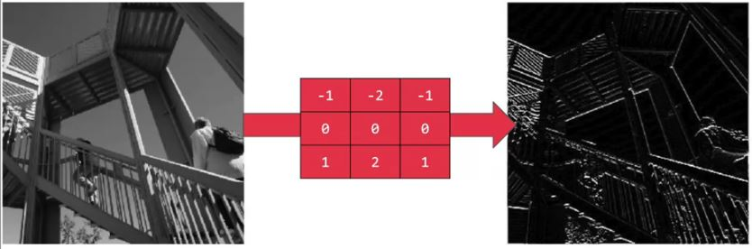

# Common Concepts About Convolutional Neural Networks

## Important Terms
| Term            | Description   |
| --------------- |---------------|
| Convolutoin     | Applying some filter on an image so certain features in the image get emphasized |
| Padding         | Adding additional border(s) to the image before convolution  |


## Convolution Example


#### How did we find -7? 🤔
We did element wise product then we get the sum of the result matrix; so:

```
3*1 + 1*0 + 1*(-1)
+
1*1 + 0*0 + 7*(-1)
+
2*1 + 3*0 + 5*(-1)
=
-7
```
And so on for other elemnts 🙃

## Edge Detection
An application of convolution operation

### Edge Detection Examples


> Result: horizontal lines pop out


> Result: vertical lines pop out

### What About other Numbers 🙄
There are a lot of ways we can put number inside elements of the filter. 

For example _Sobel_ filter is like:

```
1   0   -1
2   0   -2
1   0   -1
```

And _Scharr_ filter is like:

```
3    0   -3
10   0   -10
3    0   -3
```

> So the point here is to pay attention to the middle row

### Another Approach
We can tune these numbers by ML approach; we can say that the filter is a group of weights that:

```
w1    w2   w3
w4    w5   w6
w7    w8   w9
```

By that we can get -learned- horizontal, vertical, angled, or any edge type automatically rather than getting them by hand.


## Computational Details
If we have an `n*n` image and we convolove it by `f*f` filter the the output image will be `n-f+1*n-f+1` 

### Downsides 😪
1. If we apply many filters then our image shrinks.
2. Pixels at corners aren't being touched enough, so we are throwing away a lot of information from the edges of the image .

### Solution
We can _pad_ the image 💪 

## Padding
Adding an additional one border _or more_ to the image so the image is n+2*n+2 and after convolution we end up with n * n image which is the origianl size of the image

`p` = number of added borders

> For convention: it is filled by 0

## How much to pad?
For better understanding let's say that we have two concepts:

### Valid Convolutions
It means no padding so:

`n x n`  *  `f x f`  ➡  `n-f+1 x n-f+1`

### Same Convolutions
Pad so that output size is the **same** as the input size.

So we want that 🧐: 

`n+2p-f+1` = `n`

Hence:

`p` = `(f-1)/2`

> For convention f is chosen to be odd 👩‍🚀


## References
* [More on Convolutional Neural Networks](https://www.youtube.com/playlist?list=PLkDaE6sCZn6Gl29AoE31iwdVwSG-KnDzF)
