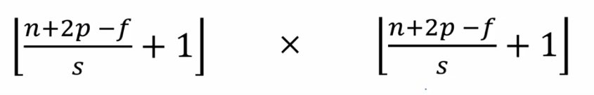

# Common Concepts About Convolutional Neural Networks

## Important Terms
| Term                | Description   |
| ------------------- |---------------|
| Strided Convolutoin | Convolving by `s` steps |

## Strided Convolution
Another approach of convolutions, we calculate the output by applying filter on regions by some value `s`. 

### Visualization 

## To Generalize

For an `n*n` image and `f*f` filter, with `p` padding and stride `s`; the output image size can be calculated by the following formula

