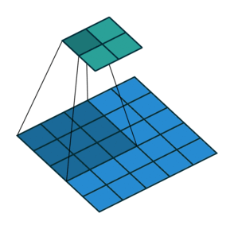

# Common Concepts About Convolutional Neural Networks

## Important Terms
| Term                | Description   |
| ------------------- |---------------|
| Strided Convolutoin | Convolving by `s` steps |

## Strided Convolution
Another approach of convolutions, we calculate the output by applying filter on regions by some value `s`. 

### Visualization 

