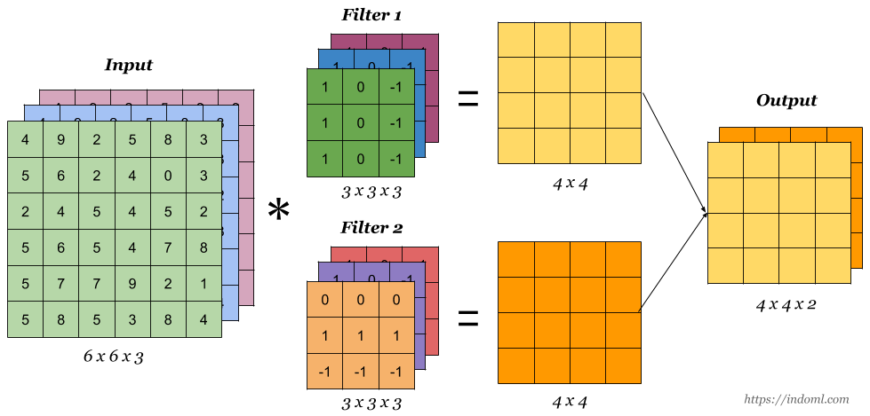

# Common Concepts About Convolutional Neural Networks

## Important Terms
| Term                | Description   |
| ------------------- |---------------|
| Strided Convolution | Convolving by `s` steps |
| Convolutions Over Volume | Applying convs on n-dimensional input (such as an RGB image) |

## Strided Convolution
Another approach of convolutions, we calculate the output by applying filter on regions by some value `s`. 

### Visualization 

## To Generalize

For an `n*n` image and `f*f` filter, with `p` padding and stride `s`; the output image size can be calculated by the following formula

## Convolutions Over Volume
To apply convoltion operation on an RGB image; for example on 10x10 px RGB image, technically the image's dimension is 10x10x3 so we can apply for example a 3x3x3 filter _or fxfx3_ 🤳

> Filters can be applied on a special color channel 🎨

### Visualization

## Multiple Filters

## Types of Layer In A Convolutional Network

| Layer                | Description   |
| -------------------- |---------------|
| Convolution `CONV`   | Filters to estract features |
| Pooling `POOL`       | A technique to reduce size of representation and to speed up the computations |
| Fully Connected `FC` | standard single neural network layer (one dimensional) |

> Usually when people report number of layers in an NN they just report the number off layers that have weights and params 

> Convention: `CONV1` + `POOL1` = `LAYER1`

## Why Convolotions?
- Better performance since they decrease the parameters that will be tuned 💫

## References
- [Convolutional Neural Networks (CNN) Introduction (😍✨✨✨)](https://indoml.com/2018/03/07/student-notes-convolutional-neural-networks-cnn-introduction/)