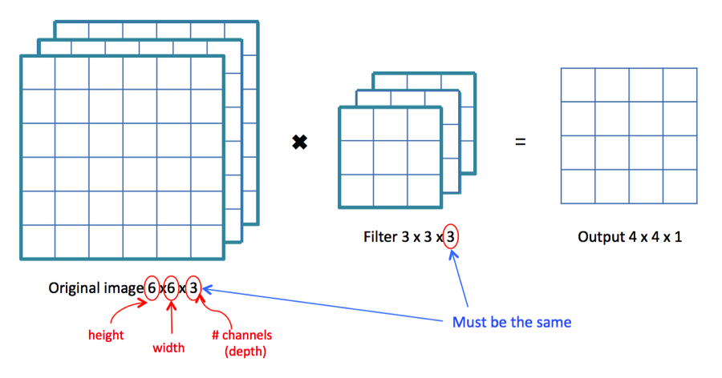
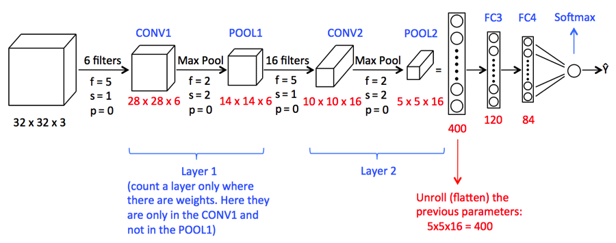

# 👀 Visualization of Convolutional Neural Networks
Visualization of concepts explained in [P1](./0-CommonConcepts.md) and [P2](./1-CommonConcepts-P2.md) to wrap them up 👩‍🎓

### 💫 Convolution
Applying a filter to extract features 🤗

**Problem 😰:** Images are shrinking 😱

### 😏 Take A Look At Padding  

Images Are Too Large, Performance is Down 😔

### 😉 Let's See Pooling

### 🙄 Well, I have an RGB image 
Filters must have depth that is equal to number of color channels

### 🤡 Ok, now I want to apply `n` filters 
Depth of the output will be equal to `n` 

## 🤗 Check Your Understanding With A Full Example 

## 🧐 References
- [DeepLearning series: Convolutional Neural Networks (😍✨✨✨)](https://medium.com/machine-learning-bites/deeplearning-series-convolutional-neural-networks-a9c2f2ee1524)