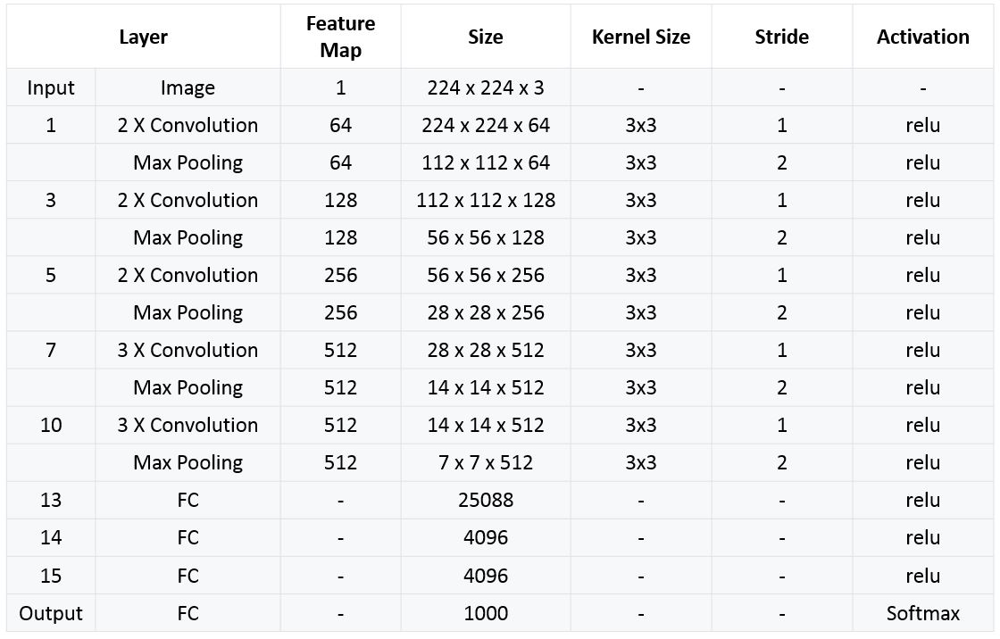

# 👵 Classic Convolutional Neural Networks
| Network    | First Usage   |
| ---------- |---------------|
| LeNet-5    | Hand written digit classification |
| AlexNet    | ImageNet Dataset |
| VGG-16     | ImageNet Dataset |

## 🔢 LeNet-5
LeNet-5 is a very simple network - By modern standards -. It only has 7 layers;
-  among which there are 3 convolutional layers _(C1, C3 and C5)_
-  2 sub-sampling (pooling) layers _(S2 and S4)_
-  1 fully connected layer _(F6)_
-  Output layer

### 👀 Visualization of the network

### 🙌 Summary of the network 

## 🛸 AlexNet

- Too similar to LeNet-5
- It has more filters per layer
- It uses _ReLU_ instead of _tanh_
- _SGD_ with momentum
- Uses dropout instead of regularaization

### 👀 Visualization of the network

### 🔎 More Detailed

### 🙌 Summary of the network 

## 🌱 VGG-16

### 👀 Visualization of the network

### 🙌 Summary of the network 

### 🔎 More Detailed

### 😐 Drawbacks 
- It is painfully slow to train (It has 138 million parameters 🙄)

## 👩‍🔧 Implementation
- [Implementation of AlexNet](https://github.com/pytorch/vision/blob/master/torchvision/models/alexnet.py   )

## 🧐 Read More
- [Detailed LeNet-5](https://engmrk.com/lenet-5-a-classic-cnn-architecture/)
- [Detailed AlexNet](https://engmrk.com/alexnet-implementation-using-keras/)
- [Detailed VGG-16](https://engmrk.com/vgg16-implementation-using-keras/)
- [Summary of classic networks](https://medium.com/analytics-vidhya/cnns-architectures-lenet-alexnet-vgg-googlenet-resnet-and-more-666091488df5)