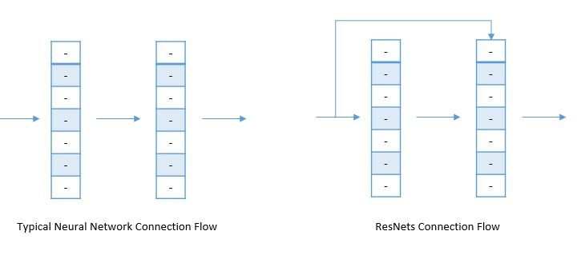

# Other Approaches for Building CNNs 
| Approach   | Description   |
| ---------- |---------------|
| Residual Networks | An approach to avoid **vanishing gradient** issue in deep NNs |
| One By One Convolution | Applying filters on **color channels** |

## Residual Networks
### Problem 🙄
During each iteration of training a neural network, all weights receive an update proportional to the partial derivative of the error function with respect to the current weight. If the gradient is very small then the weights will not be change effectively and it may completely stop the neural network from further training 🙄😪. The phenomenon is called vanishing gradients 🙁

> Simply 😅: we can say that the data is disappearing through the layers of the deep neural network due to very slow gradient descent

The core idea of ResNet is introducing a so-called **identity shortcut connection** that skips one or more layers, like the following

### Plain Nets vs ResNets

### Visualization

## Advantages
- Easy for one of the blocks to learn an **identity** function
- Can go deeper without hurting the performance 
  -  In the Plain NNs, because of the vanishing and exploding gradients problems the performance of the network suffers as it goes deeper. 

## One By One Convolutions
### Propblem (Or motivation 🤔)
We can reduce the size of inputs by applying pooling and various convolution, these filteres can reduce the height and the width of the input image, what about color channels 🌈, in other words; what about the **depth**?

### Solution
We know that the depth of the output of a CNN is equal to the number of filters that we applied on the input;

In the example above, we applied **2** filters, so the output depth is **2**

How can we use this info to improve our CNNs? 🙄

Let's say that we have a `28x28x192` dimensional input, if we apply `32` filters at `1x1x192` dimension and [SAME](./1-CommonConcepts-P2.md#same-convolutions) padding our output will become `28x28x32` ✨

## Read More
- [Detailed ResNets](https://engmrk.com/residual-networks-resnets/)