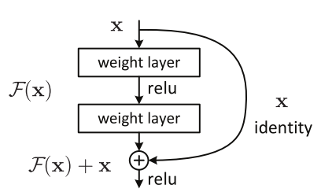

# Other Approaches for Building CNNs 
| Approach   | Description   |
| ---------- |---------------|
| Residual Networks | An approach to avoid **vanishing gradient** issue in deep NNs |

## Residual Networks
### Problem 🙄
During each iteration of training a neural network, all weights receive an update proportional to the partial derivative of the error function with respect to the current weight. If the gradient is very small then the weights will not be change effectively and it may completely stop the neural network from further training 🙄😪. The phenomenon is called vanishing gradients 🙁

> Simply 😅: we can say that the data is disappearing through the layers of the deep neural network due to very slow gradient descent: 

The core idea of ResNet is introducing a so-called **identity shortcut connection** that skips one or more layers, like the following

### Plain Nets vs ResNets

### Visualization

## Read More
- [Detailed ResNets](https://engmrk.com/residual-networks-resnets/)