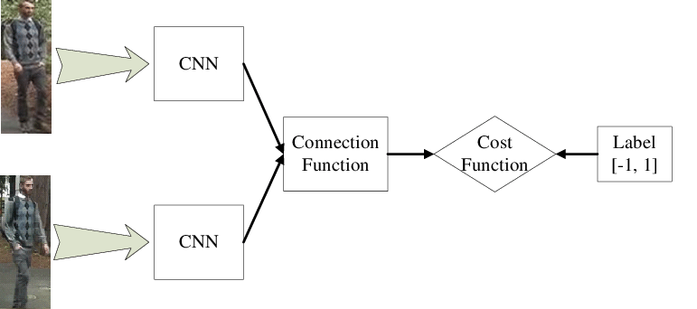
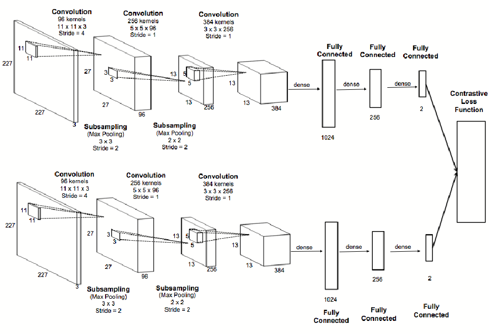

# 🕸 Common Applications of CNNs 

| Application       | Description   |
| ----------------- | ------------- |
| Face Verification | Recognizing if that the given image and ID are belonging to the same person |
| Face Recognition  | Assigning ID to the input face image |

## 🧒👧 Face Verification
### Comparison

| Term              | Description                              | Input           | Output       | Problem Class |
| ----------------- | ---------------------------------------- | --------------- | ------------ | ------------- |
| Face Verification | Cheking that this is the wanted person   | Face image / ID | True / False | 1:1           |
| Face Recognition  | Assigning ID to the input face image     | Face image      | ID of `K` faces in DB | 1:K  |

## Solving Approach

### 🤳 One Shot Learning
Learning from one example (that we have in the database) to recognize the person again 

### 🖇 The Process
- Get input image
- Check if it bilongs to the faces you have in the DB
- 

### 👓 How to Check?

We have to calculate the _similarity_ between the input image and the image in the database, so:

- Use some function that 
  - similarity(img_in, img_db) = some_val
- Specifiy a threshold value
- Check the threshold and specify the output

### 👀 What can the similarity function can be?

Siamese Network:

A CNN which is used in face verification context, it recievs two images as input, after applying convolutions it calculates a feature vector from each image and, calculates the difference between them and then gives outputs decision.

> In other words: it encodes the given images

Visualization

Architecture

### 👩‍🏫 How to Train?
We can train the network by taking an anchor (basic) image _A_ and comparing it with both a positive sample _P_ and a negative sample _N_. So that:
- The dissimilarity between the anchor image and **positive** image must **low**
- The dissimilarity between the anchor image and the **negative** image must be **high**

So:

> Another variable called *margin*, which is a **hyperparameter** is added to the loss equation. Margin defines how far away the dissimilarities should be, i.e if margin = 0.2 and d(a,p) = 0.5 then d(a,n) should at least be equal to 0.7. Margin helps us distinguish the two images better

Therefore, by using this loss function we:
- Calculate the gradients and with the help of the gradients
- We update the weights and biases of the siamese network. 

For training the network, we:
- Take an anchor image and randomly sample positive and negative images and compute its loss function
- Update its gradients