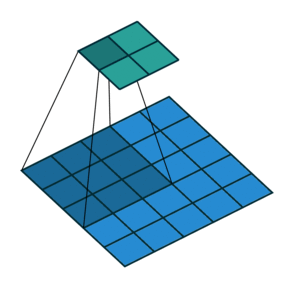
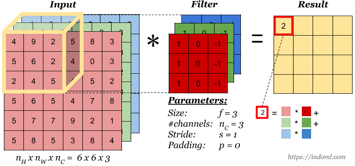

# 🌟 Advanced Concepts About Convolutional Neural Networks

## Important Terms

| Term | Description |
| :--- | :--- |
| Padding | Adding additional border\(s\) to the image before convolution |
| Strided Convolution | Convolving by `s` steps |
| Convolutions Over Volume | Applying convs on n-dimensional input \(such as an RGB image\) |

## 🙌 Padding

Adding an additional one border _or more_ to the image so the image is n+2_n+2 and after convolution we end up with n_  n image which is the origianl size of the image

`p` = number of added borders

> For convention: it is filled by 0

## 🤔 How much to pad?

For better understanding let's say that we have two concepts:

### 🕵️‍♀️ Valid Convolutions

It means no padding so:

`n x n` \* `f x f` ➡ `n-f+1 x n-f+1`

### 🥽 Same Convolutions

Pad so that output size is the **same** as the input size.

So we want that 🧐:

`n+2p-f+1` = `n`

Hence:

`p` = `(f-1)/2`

> For convention f is chosen to be odd 👩‍🚀

### 👀 Visualization

## 🔢 Strided Convolution

Another approach of convolutions, we calculate the output by applying filter on regions by some value `s`.

### 👀 Visualization

## 🤗 To Generalize

For an `n*n` image and `f*f` filter, with `p` padding and stride `s`; the output image size can be calculated by the following formula

## 🚀 Convolutions Over Volume

To apply convoltion operation on an RGB image; for example on 10x10 px RGB image, technically the image's dimension is 10x10x3 so we can apply for example a 3x3x3 filter _or fxfx3_ 🤳

> Filters can be applied on a special color channel 🎨

### 👀 Visualization

## 🤸‍♀️ Multiple Filters

## 🎨 Types of Layer In A Convolutional Network

| Layer | Description |
| :--- | :--- |
| Convolution `CONV` | Filters to estract features |
| Pooling `POOL` | A technique to reduce size of representation and to speed up the computations |
| Fully Connected `FC` | standard single neural network layer \(one dimensional\) |

> Usually when people report number of layers in an NN they just report the number off layers that have weights and params
>
> Convention: `CONV1` + `POOL1` = `LAYER1`

## 🤔 Why Convolotions?

* Better performance since they decrease the parameters that will be tuned 💫

## 🧐 References

* [Convolutional Neural Networks \(CNN\) Introduction \(😍✨✨✨\)](https://indoml.com/2018/03/07/student-notes-convolutional-neural-networks-cnn-introduction/)

