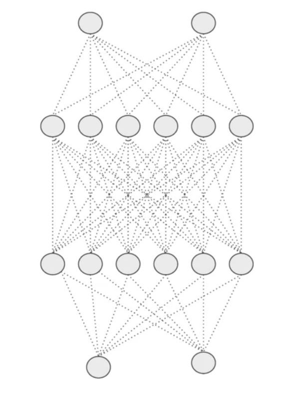
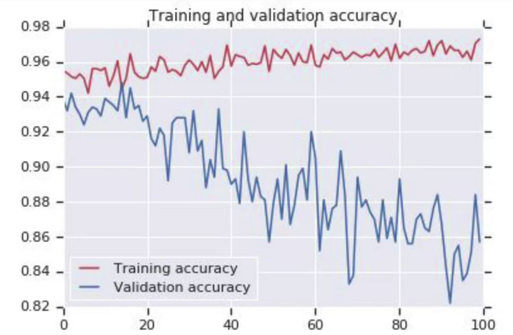
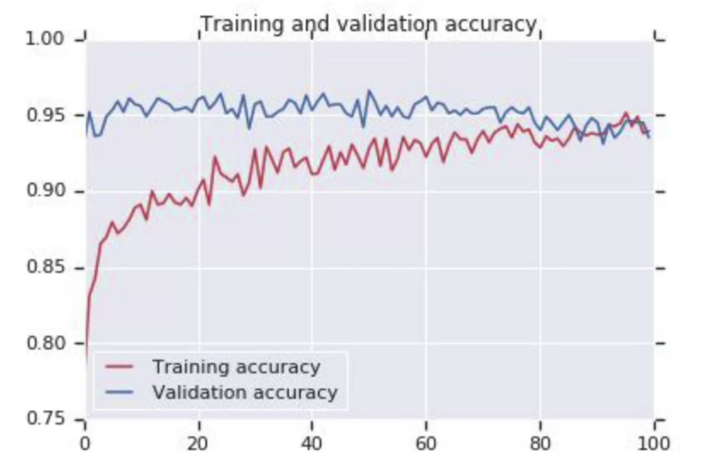

# 🚙 Transfer Learning
In short: Learning form one task and applying knowledge to seperate tasks 🛰🚙

## ❓ What is Transfer Learning?
- 🕵️‍♀️ Transfer learning is a machine learning technique where a model trained on one task is re-purposed on a second related task. 
- 🌟 In addition, it is an optimization method that allows rapid progress or improved performance when modeling the second task. 
- 🤸‍♀️ Transfer learning only works in deep learning if the model features learned from the first task are general.

> Long story short: Rather than training a neural network form scratch we can instead download an open-source model that someone else has already trained on a huge dataset maybe for weeks and use these parameters as a starting point to train our model just a little bit more with the smaller dataset that we have ✨

## 💫 Traditional ML vs Transfer Learning

## 🙄 Problem
Layers in a neural network can sometimes end up having similar weights and possible impact each other leading to **over-fitting**. With a big complex model it's a risk. So if you can imagine the dense layers can look a little bit like this.

We can drop out some neurons that has similar weights with neighbors, so that overfitting is being removed.

### 🔃 Comparison

    
    

> 🤸‍♀️ An NN before and after dropout

    
    

> ✨ Accuracy before and after dropout

## 🤔 When is it practical?
It is practical when we have a lot of data for problem that we are transferring from and usually relativly less data for the problem we are transferring to 🕵️‍

**More accurately:**

For `task A` to `task B`, it is sesnible to do transfer learning **from A to B** when:

* 🚩 Task A and task B have the same output x 
* ⭐ We have a lot more data for `task A` than `task B` 
* 🔎 Low level features from `task A` could be helpful for learning `task B` 

## 🧐 References
* [More about transfer learning in Tensorflow](https://www.tensorflow.org/tutorials/images/transfer_learning)
* [Understanding Dropout](https://www.youtube.com/watch?v=ARq74QuavAo)