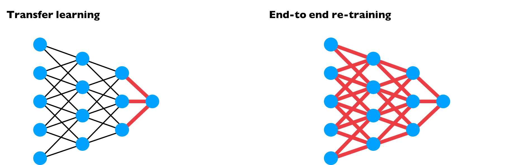

# Other Strategies of Deep Learning

## Multi-Task Learning
In short: We start simultaneously trying to have one NN do several things at same time and then each of these tasks helps all of the other tasks 🚀

**In other words:** Let's say that we want to build a detector to detect 4 classes of objects, instead of building 4 NN for each class, we can build one NN to detect the four classes 🤔 (The output layers has 4 units) 

### When Is It Practical?
* Training on a set of tasks that could benefit from having shared **lower level** features 🤳
* Amount of data we have for each task is quite similar (_sometimes_) ⛱  
* Can train a big enough NN to do well on all the tasks (instead of building a seperate network fır each task) 🤗

> Multi task learning is used much less than transfer learning 

### Visualization

## End to End Deep Learning
Briefly, there have beeen some data processing systems or kearning systems that requires multiple stages of processing, end to end learning can take all these multiple stages and replace it with just a single nn  

Long Story Short: breaking the big task int sub smaller tasks with the same NN ✂

### Pros and Cons
**Pros:**

* Shows the power of the data
* Less hand designing of components needed

**Cons:**

* May need large anount of data
* Excludes potentially useful hand designed components

### Guideline to Make Deacision to Use It
Key question: do you have sufficient data to learn a function of the complexity needed to map x to y?

## End to End Learning vs Transfer Learning

