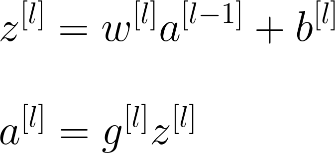

# Concepts of Artificial Neural Networks

Basic Concepts of ANN

## Basic Neural Network

> **Convention:** The NN in the image called to be a 2-layers NN since input layer is not being counted 📢❗

## Common Terms

| Term             | Description   |
| ---------------  |---------------|
| Input Layer      |  A layer that conatains the inputs to the NN |
| Hidden Layer     |  The layer(s) where computational operations are being done |
| Output Layer     |  The final layer of the NN and it is responsible for generating the predicted value ŷ |
| Neuron           |  A placeholder for a mathematical function, it applies a function on inputs and provides an output |
| Activation Function | A function that converts an input signal of a node to an output signal by applying some transformation |
| Shallow NN       |  NN with few number of hidden layers (one or two)  |
| Deep NN          |  NN with large number of hidden layers |
| n[l]  |  Number of units in _l_ layer |

## What does an artificial neuron do?
It calculates a _weighted sum_ of its input, adds a bias and then decides whether it should be _fired_ or not due to an activaiton function
> My detailed notes on activaiton functions are [here](https://github.com/asmaamirkhan/DeepLearningNotes/tree/master/6-NNConcepts/3-ActivationFunctions.md) 👩‍🏫

## Generalized Formula of Forward Propagation 

