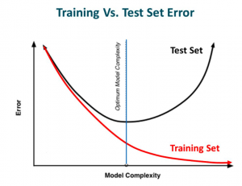
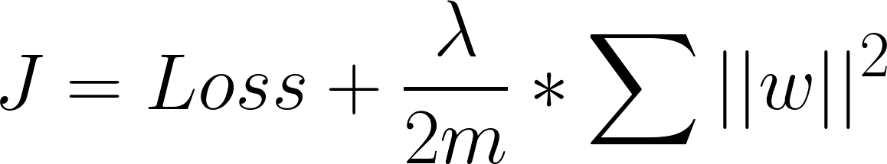
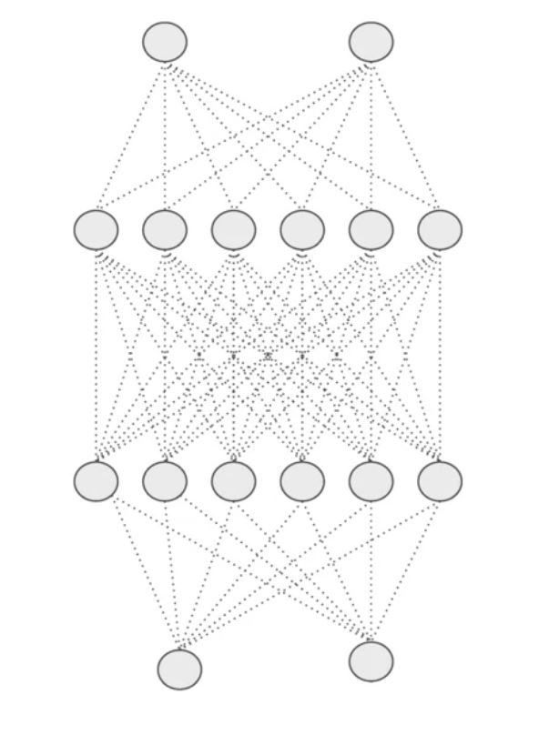
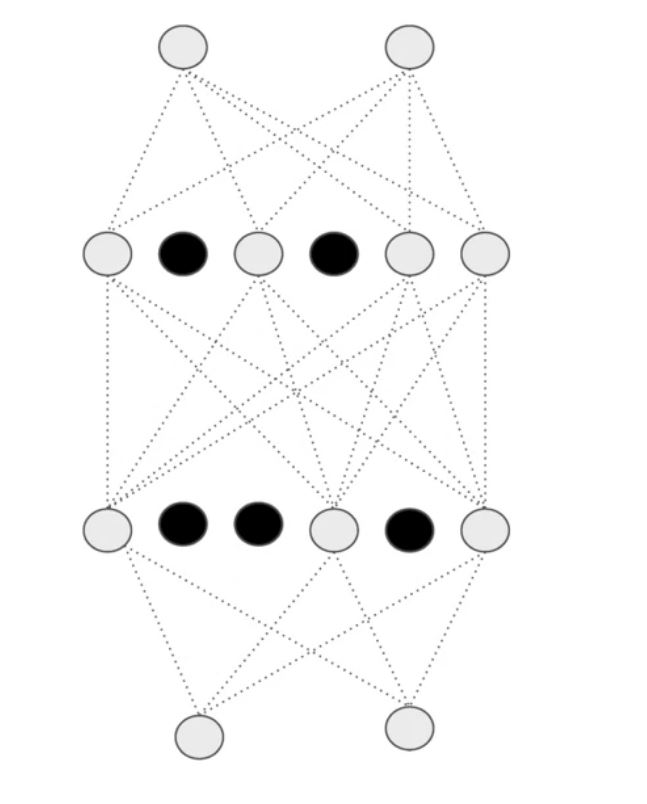

# NN Regularization
Briefly: A technique to prevent overfitting -and reduce variance-

## Problem
 In over-fitting status, our model tries to learn too well the details and the noise from the training data, which ultimately results in poor performance on the unseen data (test set), the following graph decribes better:

## Better Definition of Regularization
It is a technique which makes slight modifications to the learning algorithm such that the model generalizes better. This in turn improves the model’s performance on the unseen data as well.

## Regularization Techniques

### L2 Regularization (Weight decay)
The most common type of regularization, given by following formula:

Here, lambda is the regularization parameter. It is the **hyperparameter** whose value is optimized for better results. L2 regularization is also known as weight decay as it forces the weights to decay towards zero (but not exactly zero)

### Dropout
Another regularization method by eliminating some neurons in a specific ratio **randomly** 

> Simply: For each node of probability p, don’t update its input or output weights during backpropagation (Just drop it 😅)

Better visualiztion:

    
    

> An NN before and after dropout

It is commonly used in computer vision, but its downside is that Cost function _J_ is no longer well defined

### Data Augmentation
The simplest way to reduce overfitting is to increase the size of the training data, it is not always possible since getting more data is too costly, but sometimes we can increase our data based on our data, for example:

* Doing transformations on images can maximize our data set

### Early Stopping
It is a kind of cross-validation strategy where we keep one part of the training set as the validation set. When we see that the performance on the validation set is getting worse, we immediately stop the training on the model. This is known as early stopping.
