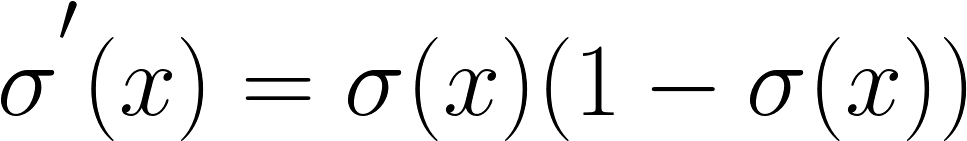
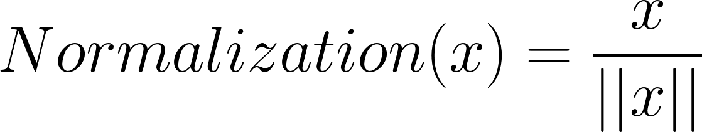
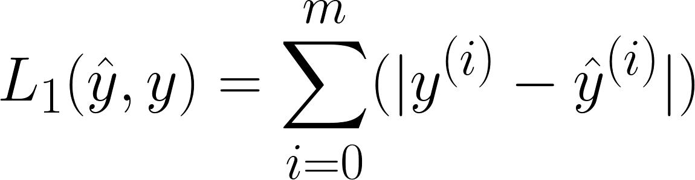
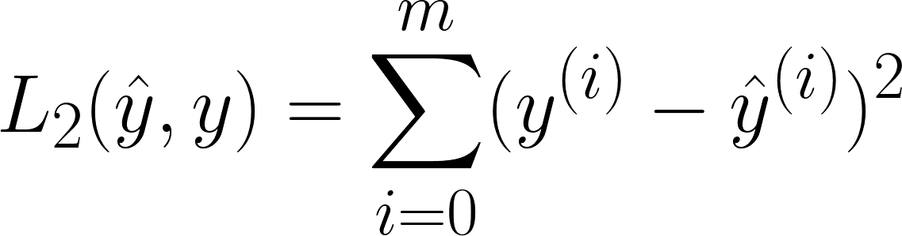

# Pyhton Code Snippets on The Basics of Neural Networks


<details>
<summary>Sigmoid Function</summary>

```python
def sigmoid(x):
    """
    Arguments:
    x -- A scalar, an array or a matrix

    Return:
    result -- sigmoid(x)
    """
    
    result = 1/(1+np.exp(-x))
    
    return result
```
</details>

[//]: ------------------------------------------------------------------------------

<details>
<summary>Sigmoid gradient</summary>

Description: A function that computes gradients to optimize loss functions using backpropagation
Formula:



```python
    def sigmoid_derivative(x):
    """
    Computes the gradient (also called the slope or derivative) of the sigmoid function with respect to its input x.
    
    Arguments:
    x -- A scalar or numpy array

    Return:
    ds -- Your computed gradient.
    """
    
    s = 1 / (1 + np.exp(-x))
    ds = s * (1 - s)
    
    return ds
```
</details>

[//]: ------------------------------------------------------------------------------

<details>
<summary>Reshaping Arrays (or images)</summary>


```python
    def arr2vec(arr, target):
     """
    Argument:
    image -- a numpy array of shape (length, height, depth)
    
    Returns:
    v -- a vector of shape (length*height*depth, 1)
    """
    
    v = image.reshape((image.shape[0]*image.shape[1], image.shape[2]))
    
    return v
```
</details>

[//]: ------------------------------------------------------------------------------

<details>
<summary>Normalizing Rows</summary>
Description: Dividing each row vector of x by its norm.

Formula:





```python
 
def normalizeRows(x):
    """
    Argument:
    x -- A numpy matrix of shape (n, m)
    
    Returns:
    x -- The normalized (by row) numpy matrix.
    """
    
    # Finding norms
    x_norm = np.linalg.norm(x, axis=1, keepdims=True)
    
    # Dividing x by its norm
    x = x / x_norm
    
    return x
```
</details>

[//]: ------------------------------------------------------------------------------

<details>
<summary>Softmax Function</summary>
Description:  A normalizing function used when the algorithm needs to classify two or more classes

Formula:


```python
 def softmax(x):
    """Calculates the softmax for each row of the input x.

    Argument:
    x -- A numpy matrix of shape (n,m)

    Returns:
    s -- A numpy matrix equal to the softmax of x, of shape (n,m)
    """
    
    # Applying exp() element-wise to x
    x_exp = np.exp(x)

    # Creating a vector x_sum that sums each row of x_exp
    x_sum = np.sum(x_exp, axis=1, keepdims=True)
    
    # Computing softmax(x) by dividing x_exp by x_sum.
    # numpy broadcasting will be used automatically.
    s = x_exp / x_sum

    return s
```
</details>

[//]: ------------------------------------------------------------------------------

<details>
<summary>L1 Loss Function</summary>
Description:  The loss is used to evaluate the performance of the model. The bigger the loss is, the more different that predictions ( ŷ ) are from the true values ( y ). In deep learning, we use optimization algorithms like Gradient Descent to train the model and to minimize the cost.

Formula:





```python
def L1(yhat, y):
    """
    Arguments:
    yhat -- vector of size m (predicted labels)
    y -- vector of size m (true labels)
    
    Returns:
    loss -- the value of the L1 loss function defined above
    """
    
    loss = np.sum(np.abs(y - yhat))
    
    return loss
```
</details>


[//]: ------------------------------------------------------------------------------

<details>
<summary>L2 Loss Function</summary>
Description:  The loss is used to evaluate the performance of the model. The bigger the loss is, the more different that predictions ( ŷ ) are from the true values ( y ). In deep learning, we use optimization algorithms like Gradient Descent to train the model and to minimize the cost.

Formula:





```python
def L2(yhat, y):
    """
    Arguments:
    yhat -- vector of size m (predicted labels)
    y -- vector of size m (true labels)
    
    Returns:
    loss -- the value of the L2 loss function defined above
    """
    
    loss = np.sum((y - yhat) ** 2)
    
    return loss
```
</details>

