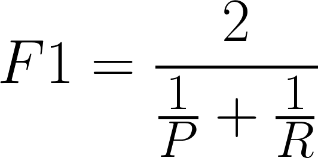

# 👩‍🔧 Notes on Structuring Machine Learning Projects

## ✨ How to effectively set up evaluation metrics?
* While looking to precesion _P_ and recall _R_ (for example) we may be not able to choose the best model correctly
  * So we have to create a new evaluation metric that makes a relation between _P_ an _R_
  * Now we can choose the best model duw to our new metric 🐣
  * For example: (as a popular associated metric) _F1 Score_ is:
    * 

* To summarize: we can construct our own metrics due to our models and values to be able to get the best choice 👩‍🏫

## 📚 Types of Metrics

For better evalution we have to classify our metrics as the following:

| Metric Type        | Description                                    |
| ------------------ | ---------------------------------------------- |
| Optimizing Metric  |  A metric that has to be in its **best** value |
| Satisficing Metric |  A metric that just has to be **good enough**  |

Technically, If we have `N` metrics we have to try to optimize `1` metric and to satisfice  `N-1` metrics 🙄

> Clarification: we tune saticficing metrics due to a _threshold_ that we determine

## 🚀 How to set up datasets to maximize the efficiency
* It is recommended to choose the dev and test sets from the same destribution, so we ahve to shuffle the data randomly and then split it. As a result, both test and dev sets have data from all categories ✨  

### 👩‍🏫 Guideline
We have to choose a dev set and test set - _from same distribution_ - to reflect data we expect to get in te future and consider important to do well on

## 🤔 How to choose the size of sets
* If we have a small dataset (m < 10,000)
  * 60% training, 20% dev, 20% test will be good 
* If we have a huge dataset (1M for example)
  * 99% trainig, %1 dev, 1% test will be acceptable 
> And so on, considering these two statuses we can choose the correct ratio 👮‍

## 🙄 When to change dev/test sets and metrics
**Guideline:** if doing well on metric + dev/test set and doesn't correspond to doing well in the **real world application**, we have to change our metric and/or dev/test set 🏳