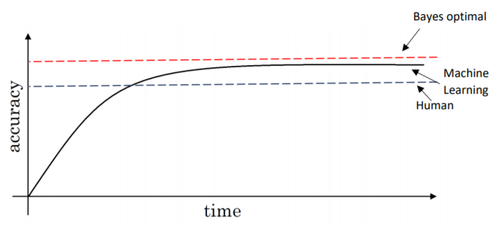

# Guidelines On Implementation

## Common Terms

| Term                 | Description                                    |
| -------------------- | ---------------------------------------------- |
| Bayes Error 👩‍🎓       |  The **lowest** possible error rate for any classifier (The optimal error 🤔) |
| Human Level Error 👩‍🏫 |  The error rate that can be obtained by a human |
| Avoidable Bias 👮‍    |  The difference between Bayes error and human level error |

## I did my best, my project is still doing bad, what shall I do? 😥
Well, in this stage we have a criteria, is your model doing worse than humans (Because humans are quite good at a lot of tasks 👩‍🎓)? If yes, you can:
* Get labeled data from humans 👩‍🏫
* Gain insight from manual error analysis; (Why did a person get this right? 🙄) 
* Better analysis of bias / variance 🔍

> Note: knowing how well humans can do on a task can help us to understand better how much we should try to reduce bias and variance  

Is your model doing better than humans?

* Processes are less clear 😥

> Suitable techniques will be added here

## Study case
Let's assume that we have these two situations:

|                    | Case1      | Case2    | 
| ------------------ | :--------: | :------: |
| Human Error        | 1%         | 7.5%     |     
| Training Error     | 8%         | 8%       |
| Dev Error          | 10%        | 10%      |

Even though training and dev errors are same we will apply different tactics for better performance
* In **Case1**, We have `High Bias` so we have to focus on _bias reduction techniques_ 🤔, in other words we have to reduce the difference between training and uman errors **the avoidable error**
  * Better algorithm, better NN structure, ......
* In **Case**, We have `High Variance` so we have to focus on _variance reduction techniques_ 🙄, in other words we have to reduce the difference between training and dev errors
  * Adding regularization, getting more data, ......

> We call this procedure of analysis **Error analysis** 🕵️‍

## Error Types Visualization

> In computer vision issues, `human-level-error ≈ bayes-error` because humans are good in vision tasks

## Problems thar ML surpasses human level performance 🤗
* Online advertising
* Product recommendations
* Logistics
* Loan approvals
* .....

## My Detailed Notes on Bias / Variance and Related Procedures
* [Here 🐾](../0-NNConcepts/4-PracticalAspects.md)

## It is recommended to 👀
When we have a new project it is recommended to produce an initial model and then iterate over it until you get the best model, this is more practical than spending time building model theoretical and thinking about the best hyperparameter *-which is almost impossible 🙄-*

> So, just don't overthink! **(In both ML problems and life problems 🤗🙆‍)**

