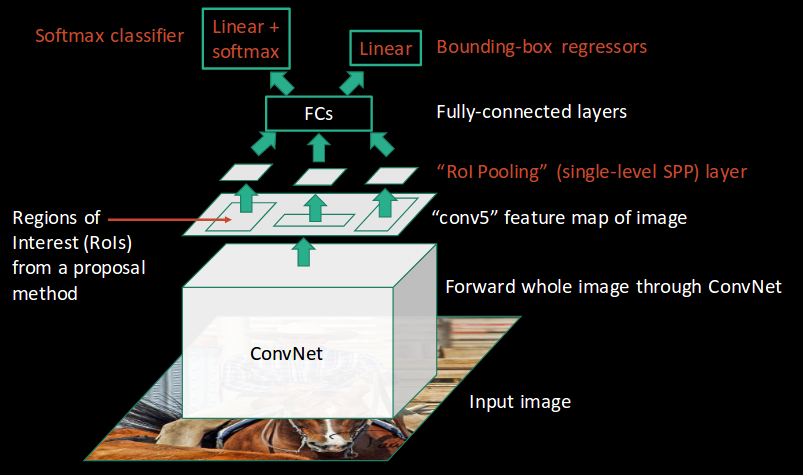

# 🚩 Region-Based CNNs

## 🔷 R-CNN _(Region Based Convoltional Neural Network)_
It depends on:
- Selecting huge number of regions
- And then decrease them to 2000 by _selective search_
  - Each region is called a _region proposal_
- Extracting convolutional features from each region
- Finally checking if any object exists

### 👀 Visualization

 

### 🙄 Disadvantages
- It takes too many time to be trained.
- It can not be impelemented real time.
- The selective search algorithm is a fixed algorithm. Therefore, no learning is happening at that stage.
  - This could lead to the generation of bad candidate region proposals.

### 🤔 Why are they slow?
R-CNNs are very slow 🐢 beacause of:
- Extracting 2,000 regions for each image based on selective search
- Extracting features using CNN for every image region. 
  - If we have N images, then the number of CNN features will be N*2000 😢

## 💫 Fast R-CNN _(Fast Region Based Convoltional Neural Networks)_
Instead of running a CNN 2,000 times per image, we can run it just once per image and get all the regions of interest (regions containing some object).

So, it depends on:
- We feed the **whole** image to the CNN
- The CNN generates a feature map
- Using the generated feature map we extract ROI (Region of interests)
  - Problem of 2000 regions is solved 🎉
  - We are still using selective search 🙄
- Then, we resize the regions into a fixed size (using ROI pooling layer)
- Finally, we feed regions to fully connected layer (to classify)

### 👀 Visualiztion

 

### 🙄 Disadvantages
Region proposals still bottlenecks in Fast R-CNN algorithm and they affect its performance.

## ➰ Faster R-CNN _(Fast Region Based Convoltional Neural Networks)_
Faster R-CNN fixes the problem of selective search by replacing it with Region Proposal Network (RPN) 🤗
