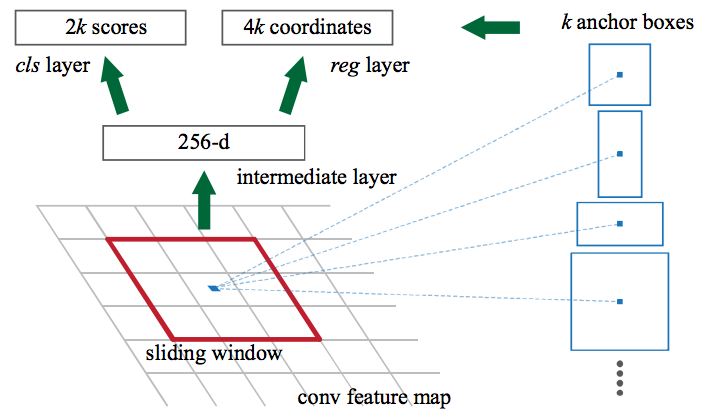

# 🚩 Region-Based CNNs

## 🔷 R-CNN _(Region Based Convoltional Neural Network)_
It depends on:
- Selecting huge number of regions
- And then decrease them to 2000 by _selective search_
  - Each region is called a _region proposal_
- Extracting convolutional features from each region
- Finally checking if any object exists

### 👀 Visualization

 

### 🙄 Disadvantages
- It takes too many time to be trained.
- It can not be impelemented real time.
- The selective search algorithm is a fixed algorithm. Therefore, no learning is happening at that stage.
  - This could lead to the generation of bad candidate region proposals.

### 🤔 Why are they slow?
R-CNNs are very slow 🐢 beacause of:
- Extracting 2,000 regions for each image based on selective search
- Extracting features using CNN for every image region. 
  - If we have N images, then the number of CNN features will be N*2000 😢

## 💫 Fast R-CNN _(Fast Region Based Convoltional Neural Networks)_
Instead of running a CNN 2,000 times per image, we can run it just once per image and get all the regions of interest (regions containing some object).

So, it depends on:
- We feed the **whole** image to the CNN
- The CNN generates a feature map
- Using the generated feature map we extract ROI (Region of interests)
  - Problem of 2000 regions is solved 🎉
  - We are still using selective search 🙄
- Then, we resize the regions into a fixed size (using ROI pooling layer)
- Finally, we feed regions to fully connected layer (to classify)

### 👀 Visualiztion

 

### 🙄 Disadvantages
Region proposals still bottlenecks in Fast R-CNN algorithm and they affect its performance.

## ➰ Faster R-CNN _(Fast Region Based Convoltional Neural Networks)_
Faster R-CNN fixes the problem of selective search by replacing it with Region Proposal Network (RPN) 🤗

So, it depends on:
- We feed the **whole** image to the CNN
- The CNN generates a feature map
- We apply Region proposal network is applied on feature map 
- The RPN returns the object proposals along with their _objectness_ score
  - Problem of selective search is solved 🎉
- Then, we resize the regions into a fixed size (using ROI pooling layer)
- Finally, we feed regions to fully connected layer (to classify)

### 👀 Visualization

### 👩‍🏫 How does RPN works? 
1. RPN takes a feature map from CNN
2. Uses 3*3 window over the map
3. Generates _k_ anchor boxes
   - Boxes are in different shapes and sizes

Anchor boxes are fixed sized boundary boxes that are placed throughout the image and have different shapes and sizes. For each anchor, RPN predicts two things:

1. The probability that an anchor is an object
   - (it does not consider which class the object belongs to)
2. The bounding box regressor for adjusting the anchors to better fit the object

#### 👀 Visualization

## 😵 To put them all together

| Algorithm       | Summary                                                            | Limitations           |
| --------------- | ------------------------------------------------------------------ | --------------------- |
| 🔷 R-CNN        |  Extracts around 2000 regions from images using _selective search_ | High computation time |
| 💫 Fast R-CNN   |  Image is passed once to CNN to extract feature maps, regions are extracted by selective search then | Selective search is slow |
| ➰ Faster R-CNN |  Replaces the selective search method with RPN          | slow (?)  |

## 🔎 Read More
- [A Step-by-Step Introduction to the Basic Object Detection Algorithms](https://www.analyticsvidhya.com/blog/2018/10/a-step-by-step-introduction-to-the-basic-object-detection-algorithms-part-1/)
- [Deep Learning for Object Detection: A Comprehensive Review](https://towardsdatascience.com/deep-learning-for-object-detection-a-comprehensive-review-73930816d8d9)