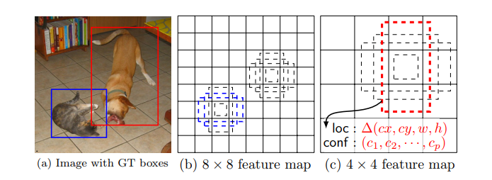

# 🤳 SSD and YOLO

## 😉 You Only Look Once
- 💥 The approach involves a single neural network trained end to end
  - It that takes a photograph as input and predicts bounding boxes and class labels for each bounding box directly.
- 😕 The technique offers lower predictive accuracy (e.g. more localization errors) _Compared with region based models_
- ➗ YOLO divides the input image into an S×S grid. Each grid cell predicts only one object

> 👷‍♀️ Long Story Short: The system divides the input image into an S × S grid. If the center of an object falls into a grid cell, that grid cell is responsible for detecting that object.

### 🎀 Advantages
- 🚀 Speed
- 🤸‍♀️ Feasible for real time applications

### 🙄 Disadvantages
- 😕 Poor performance on small-sized objects
  - It tends to give imprecise object locations.

> TODO: Compare versions of YOLO

## 🤸‍♀️ SSD
- 💥 Predicts objects in images using a single deep neural network. 
- 🤓 The network generates scores for the presence of each object category using small convolutional filters applied to feature maps.
- ✌ This approach uses a feed-forward CNN that produces a collection of **bounding boxes** and **scores** for the presence of certain objects.
- ❗ In this model, each feature map cell is linked to a set of default bounding boxes

### 👩‍🏫 Details
- After going through a certain of convolutions for feature extraction, we obtain a **feature layer** of size m×n (number of locations) with p channels, such as 8×8 or 4×4 above. 
  - And a 3×3 conv is applied on this m×n×p feature layer.
- For each location, we got k bounding boxes. These k bounding boxes have different sizes and aspect ratios. 
  - The concept is, maybe a vertical rectangle is more fit for human, and a horizontal rectangle is more fit for car.
- For each of the bounding box, we will compute c class scores and 4 offsets relative to the original default bounding box shape.

### 🤓Long Story Short 
The SSD object detection composes of 2 parts:
- Extract feature maps
- Apply convolution filters to detect objects.

### 🕵️‍♀️ Evaluation
- Better accuracy compared to YOLO 
- Better speed compared to Region based algorithms

### 👀 Visualization

## 🚫 SSD vs YOLO

## 🧐 References
- [A 2019 Guide to Object Detection](https://heartbeat.fritz.ai/a-2019-guide-to-object-detection-9509987954c3)
- [Review: SSD — Single Shot Detector (Object Detection) ✨](https://towardsdatascience.com/review-ssd-single-shot-detector-object-detection-851a94607d11)
- [More on YOLO](https://medium.com/@jonathan_hui/real-time-object-detection-with-yolo-yolov2-28b1b93e2088)