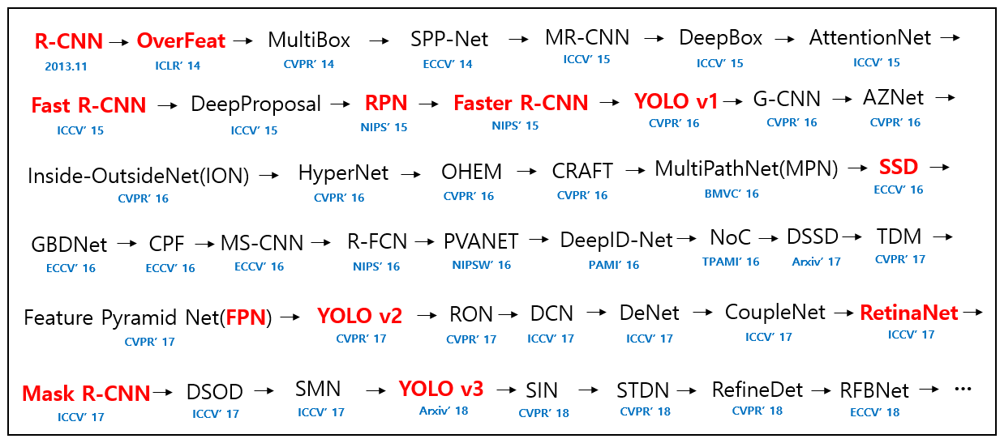

# 🕵️‍♀️ Basics of Object Detection

## 📚 Common Terms

| Term                 | Description                                    |
| -------------------- | ---------------------------------------------- |
| Classification       |  Specifying the label (class) of an object in input image |
| Classification and Localization |  Specifying the label and coordinates of an object in input image |
| Object Detection     |  Specifying labels and coordinates of multiple objects in input image        |

## 📑 More Detailed 

|             | Classification  | Clf. and Localization | Detection              |
| ----------- | --------------- | --------------------- | ---------------------- |
| #of objects |  1              | 1                     | multiple               |
| Input       |  image          | image                 | image                  |
| Output      |  label          | label + coordinates   | label(s) + coordinates |

## ✨ Popular Detection CNNs
- **R-CNN** (Regional Based Convolutional Neural Networks)
- **Fast R-CNN** (Regional Based Convolutional Neural Networks)
- **Faster R-CNN** (Regional Based Convolutional Neural Networks)
- **RFCN** (Region Based Fully Connected Convolutional Neural Networks)
- **YOLO** (You Only Look Once)
  - YOLO V1
  - YOLO V2
  - YOLO V3
- **SSD** (Single Shot Detection)

## ✨ Popular Classification CNNs
- LeNet
- AlexNet
- MobileNet
- ResNet
- VGG

## 🤸‍♀️ Object Detection Series
