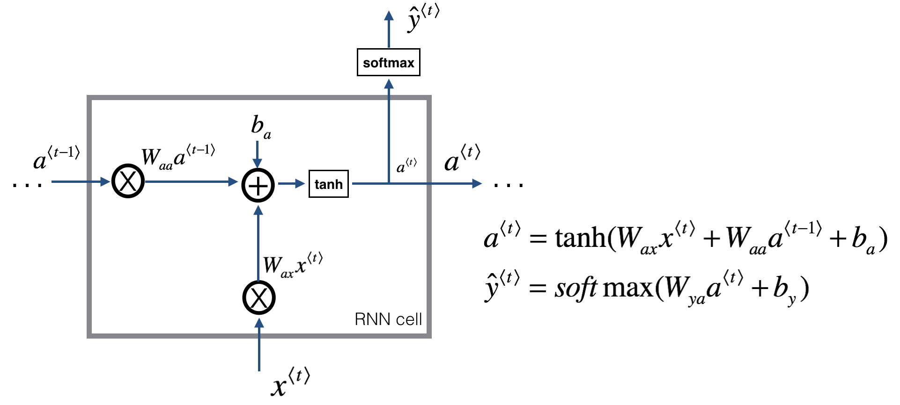
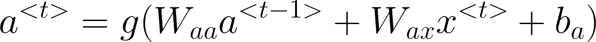
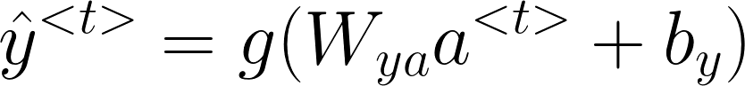
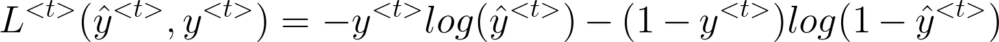
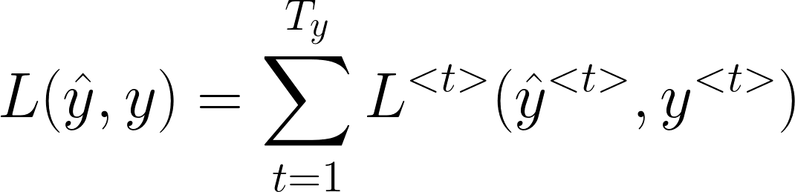

# 🔄 Recurrent Neural Networks

## 🔎 Definition
A class of neural networks that allow previous outputs to be used as inputs to the next layers
> They remember things they learnt during training ✨

## 🧱 Architecture

### 🔶 The Whole RNN Architecture

### 🧩 An RNN Cell

Basic RNN cell. Takes as input x⟨t⟩ (current input) and a⟨t−1⟩ (previous hidden state containing information from the past), and outputs a⟨t⟩ which is given to the next RNN cell and also used to predict y⟨t⟩

## ⏩ Forward Propagation
**To find a<<i>t</i>>:**

**To find ŷ<<i>t</i>>:**

### 👀 Visualization

## ⏪ Back Propagation
**Loss Function is defined like the following**

 

## 🎨 Types of RNNs
- **One-to-One** (Traditional ANN)
- **One-to-Many** (Music Generation)
- **Many-to-One** (Semantic Analysis)
- **Many-to-Many** Tx = Ty (Speech Recognition)
- **Many-to-Many** Tx != Ty (Machine Translation)

# 🔥 Advanced Recurrent Neural Networks

## 🔄 Bidirectional RNNs (BRNN)
- In many applications we want to output a prediction of y (t) which may depend on the whole input sequence
- Bidirectional RNNs combine an RNN that moves **forward** through time beginning from the start of the sequence with another RNN that moves **backward** through time beginning from the end of the sequence ✨

### 💬 In Other Words
- Bidirectional recurrent neural networks(RNN) are really just putting two independent RNNs together. 
- The input sequence is fed in normal time order for one network, and in reverse time order for another. 
- The outputs of the two networks are usually concatenated at each time step.
- 🎉 This structure allows the networks to have both backward and forward information about the sequence at every time step. 

### 👎 Disadvantages
We need the entire sequence of data efore you can make prediction anywhere.

>e.g: not suitable for real time speach recognition 

### 👀 Visualization

## 🕸 Deep RNNs
The computation in most RNNs can be decomposed into three blocks of parameters and associated transformations:
1. From the input to the hidden state, x(t) ➡ a(t)
2. From the previous hidden state to the next hidden state, a(t-1) ➡ a(t)
3. From the hidden state to the output, a(t) ➡ y(t)

We can use multiple layers for each of the above transformations, which results in deep recurrent networks 😋

### 👀 Visualization

## ❌ Problem: Vanishing Gradients with RNNs
- An RNN that process a sequence data with the size of 10,000 time steps, has 10,000 deep layers which is very hard to optimize 🙄
- Same in Deep Neural Networks, deeper networks are getting into the vanishing gradient problem. 
- That also happens with RNNs with a long sequence size 🐛

### 🧙‍♀️ Solutions
- Read [Part-2](./2-VanishingGradients.md) for my notes on Vanishing Gradients with RNNs 🤸‍♀️

## 🧐 Read More
- [Recurrent Neural Networks Cheatsheet ✨](https://stanford.edu/~shervine/teaching/cs-230/cheatsheet-recurrent-neural-networks#)
- [All About RNNs 🚀](https://medium.com/@jianqiangma/all-about-recurrent-neural-networks-9e5ae2936f6e)