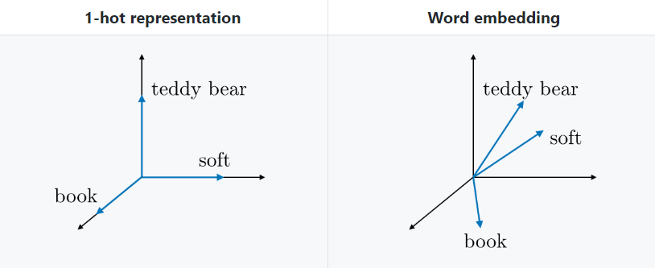

# 💬 Basic Concepts of NLP
Basic concepts of Natural Language Processing

## 👒 Word Representation
- [One Hot Encoding](./0-GeneralConcepts.md#-one-hot-encoding)
- Featurized Representation (Word Embedding)
- Word2Vec
- GloVe (Global Vectors for Word Representation)

### 🎎 Word Embedding
- Representing words by associating them with features such as gender, age, royal, food, cost, size.... and so on 
- Every feature is represented as a range between [-1, 1] 
- Thus, every word can be represented as a vector of these features
  - The dimension of each vector is related to the number of features that we pick

#### 🔢 Embedded Matrix
For a given word _w_, the embedding matrix _E_ is a matrix that maps its 1-hot representation ow to its embedding ew as follows:

#### 🎀 Advantages
- Words that have the **same** meaning have a **similar** representation.
- Vectors are smaller than vectors in one hot representation

> TODO: Subtracting vectors of oppsite words

#### 🚀 One Hot Rep. vs Word Embedding

### 🔄 Word2Vec
> TODO

### 🧤 GloVe

> TODO:
> Skip gram
> GloVE

## 🧐 References
- [Recurrent Neural Networks Cheatsheet ✨](https://stanford.edu/~shervine/teaching/cs-230/cheatsheet-recurrent-neural-networks)