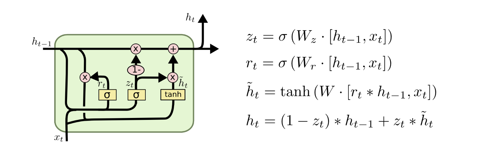

# 🌌 Vanishing Gradients with RNNs
- An RNN that process a sequence data with the size of 10,000 time steps, has 10,000 deep layers which is very hard to optimize 🙄
- Same in Deep Neural Networks, deeper networks are getting into the vanishing gradient problem. 
- That also happens with RNNs with a long sequence size 🐛

## 🧙‍♀️ Solutions
- **GRU** _Gated Recurrent Unit_ 
- **LSTM** _Long Short-Term Memory_ 

## 🚪 Gated Recurrent Unit (GRU)
GRUs are improved version of standard recurrent neural network ✨, GRU uses _update gate and reset gate_ . 
- Basically, these are two vectors which decide what information should be passed to the output. 
- The special thing about them is that they can be trained to keep information from long ago
  - Without washing it through time or removing information which is relevant to the prediction.

| Gate           | Description                                 |
| -------------- |---------------------------------------------|
| 🔁 Update Gate | Helps the model to determine how much of the past information (from previous time steps) needs to be passed along to the future |
| 0️⃣ Reset Gate  | Helps the model to decide how much of the past information to **forget** |

### 🔁 Update Gate
Given this gate the issue of the vanishing gradient is eliminated since the model on its own learn how much of the past information to pass to the future.
> In short: How much past should matter now? 🙄

### 0️⃣ Reset Gate
This gate has the opposite functionality in comparison with the update gate since it is used by the model to decide how much of the past information to forget.
> In short: Drop previous information? 🙄

### 💬 Current Memory Content
Memory content which will use the reset gate to store the relevant information from the past.

### 🎈 Final Memory at Current Time Step
A vector which holds information for the current unit and it will pass it further down to the network.

### 👀 Visualization 

### 🎉 GRU Conclusion
- A solution to eliminate the **vanishing gradient** problem 
- The model is not washing out the new input every single time but keeps the relevant information and passes it down to the next time steps of the network.

## 🤸‍♀️ Long Short-Term Memory

### 0️⃣ Forget Gate
- Let's assume we are reading words in a piece of text, and want use an LSTM to keep track of grammatical structures, such as whether the subject is singular or plural. 
- If the subject changes from a singular word to a plural word, we need to find a way to get rid of our previously stored memory value of the singular/plural state. 
- In an LSTM, the forget gate let us do this:

$$\Gamma ^{<t>}_f = \sigma(W_f[a^{<t-1>}, x^{<t>}]+b_f)$$

- Here,  $W_f$  are weights that govern the forget gate's behavior. We concatenate  $$[a^{<t-1>}, x^{<t>}]$$  and multiply by  $$W_f$$. The equation above results in a vector  $$\Gamma_f^{<t>}$$  with values between 0 and 1. 
- This forget gate vector will be multiplied element-wise by the previous cell state $$c^{<t-1>}$$. 
- So if one of the values of $$\Gamma_f^{<t>}$$ is 0 (or close to 0) then it means that the LSTM should remove that piece of information (e.g. the singular subject) in the corresponding component of  $$c^{<t-1>}$$ . 
- If one of the values is 1, then it will keep the information.

### 🔄 Update Gate
Once we forget that the subject being discussed is singular, we need to find a way to update it to reflect that the new subject is now plural. Here is the formula for the update gate:

$$\Gamma ^{<t>}_u = \sigma(W_u[a^{<t-1>}, x^{<t>}]+b_u)$$

Similar to the forget gate, here  $$\Gamma_u^{<t>}$$  is again a vector of values between 0 and 1. This will be multiplied element-wise with  $$\tilde{c}^{<t>}$$, in order to compute $$c^{⟨t⟩}$$.

### 👩‍🔧 Updating the Cell
To update the new subject we need to create a new vector of numbers that we can add to our previous cell state. The equation we use is:

$$\tilde{c}^{<t>}=tanh(W_c[a^{<t-1>}, x^{<t>}]+b_c)$$

Finally, the new cell state is:

$$c^{<t>}=\Gamma _f^{<t>}*c^{<t-1>} + \Gamma _u^{<t>}*\tilde{c}^{<t>}$$

### 🚪 Output Gate
To decide which outputs we will use, we will use the following two formulas:

$$\Gamma _o^{<t>}=\sigma(W_o[a^{<t-1>}, x^{<t>}]+b_o)$$

$$a^{<t>} = \Gamma _o^{<t>}*tanh(c^{<t>})$$

Where in first equation we decide what to output using a sigmoid function and in second equation we multiply that by the _tanh_ of the previous state.

> GRU is newer than LSTM, LSTM is more powerful but GRU is easier to implement 🚧

## 🧐 Read More
- [What are RNNs and GRUs](https://towardsdatascience.com/what-is-a-recurrent-nns-and-gated-recurrent-unit-grus-ea71d2a05a69)
- [Understanding GRU Networks](https://towardsdatascience.com/understanding-gru-networks-2ef37df6c9be)
- [Detailed LSTM](http://colah.github.io/posts/2015-08-Understanding-LSTMs/)