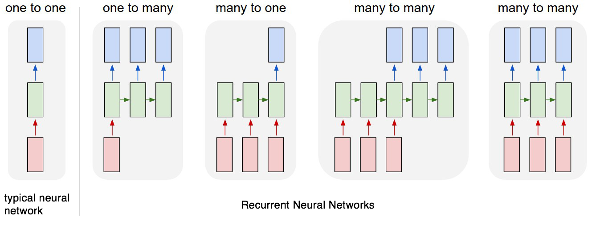

# 🔄 Recurrent Neural Networks

## 🔄 Recurrent Neural Networks

### 🔎 Definition

A class of neural networks that allow previous outputs to be used as inputs to the next layers

> They remember things they learned during training ✨

### 🧱 Architecture

#### 🔶 The Whole RNN Architecture

#### 🧩 An RNN Cell

Basic RNN cell. Takes as input $$x^{⟨t⟩}$$ \(current input\) and $$a^{⟨t−1⟩}$$ \(previous hidden state containing information from the past\), and outputs $$a^{⟨t⟩}$$ which is given to the next RNN cell and also used to predict $$y^{⟨t⟩}$$

### ⏩ Forward Propagation

**To find** $$a^{<t>}$$**:**

$$a^{<t>}=g(W_{aa}a^{<t-1>}+W_{ax}x^{<t>}+b_a)$$

**To find** $$\hat{y}^{<t>}$$**:**

$$\hat{y}^{<t>} = g(W_{ya}a^{<t>}+b_y)$$

#### 👀 Visualization

### ⏪ Back Propagation

**Loss Function is defined like the following**

$$L^{<t>}(\hat{y}^{<t>}, y^{<t>})=-y^{<t>}log(\hat{y})-(1-y^{<t>})log(1-\hat{y}^{<t>})$$

$$L(\hat{y},y)=\sum_{t=1}^{T_y}L^{<t>}(\hat{y}^{<t>}, y^{<t>})$$

### 🎨 Types of RNNs

* 1️⃣ ➡ 1️⃣ **One-to-One** \(Traditional ANN\)
* 1️⃣ ➡ 🔢 **One-to-Many** \(Music Generation\)
* 🔢 ➡ 1️⃣ **Many-to-One** \(Semantic Analysis\)
* 🔢 ➡ 🔢 **Many-to-Many** $$T_x = T_y$$ \(Speech Recognition\)
* 🔢 ➡ 🔢 **Many-to-Many** $$T_x \neq T_y$$ \(Machine Translation\)

## 🔥 Advanced Recurrent Neural Networks

### 🔄 Bidirectional RNNs \(BRNN\)

* In many applications we want to output a prediction of $$y^{(t)}$$ which may depend on the whole input sequence
* Bidirectional RNNs combine an RNN that moves **forward** through time beginning from the start of the sequence with another RNN that moves **backward** through time beginning from the end of the sequence ✨

#### 💬 In Other Words

* Bidirectional recurrent neural networks\(RNN\) are really just putting two independent RNNs together. 
* The input sequence is fed in normal time order for one network, and in reverse time order for another. 
* The outputs of the two networks are usually concatenated at each time step.
* 🎉 This structure allows the networks to have both backward and forward information about the sequence at every time step. 

#### 👎 Disadvantages

We need the entire sequence of data before we can make prediction anywhere.

> e.g: not suitable for real time speech recognition

#### 👀 Visualization

### 🕸 Deep RNNs

The computation in most RNNs can be decomposed into three blocks of parameters and associated transformations: 1. From the input to the hidden state, $$x^{(t)}$$ ➡ $$a^{(t)}$$ 2. From the previous hidden state to the next hidden state, $$a^{(t-1)}$$ ➡ $$a^{(t)}$$ 3. From the hidden state to the output, $$a^{(t)}$$ ➡ $$y^{(t)}$$

We can use multiple layers for each of the above transformations, which results in deep recurrent networks 😋

#### 👀 Visualization

### ❌ Problem: Vanishing Gradients with RNNs

* An RNN that processes a sequence data with the size of 10,000 time steps, has 10,000 deep layers which is very hard to optimize 🙄
* Same in Deep Neural Networks, deeper networks are getting into the vanishing gradient problem 🥽
* That also happens with RNNs with a long sequence size 🐛

#### 🧙‍♀️ Solutions

* Read [Part-2](https://github.com/asmaamirkhan/DeepLearningNotes/tree/d20deec6ead832c6650a0d761212dfafef64b302/9-SequenceModels/2-VanishingGradients.md) for my notes on Vanishing Gradients with RNNs 🤸‍♀️

### 🧐 Read More

* [Recurrent Neural Networks Cheatsheet ✨](https://stanford.edu/~shervine/teaching/cs-230/cheatsheet-recurrent-neural-networks#)
* [All About RNNs 🚀](https://medium.com/@jianqiangma/all-about-recurrent-neural-networks-9e5ae2936f6e)

