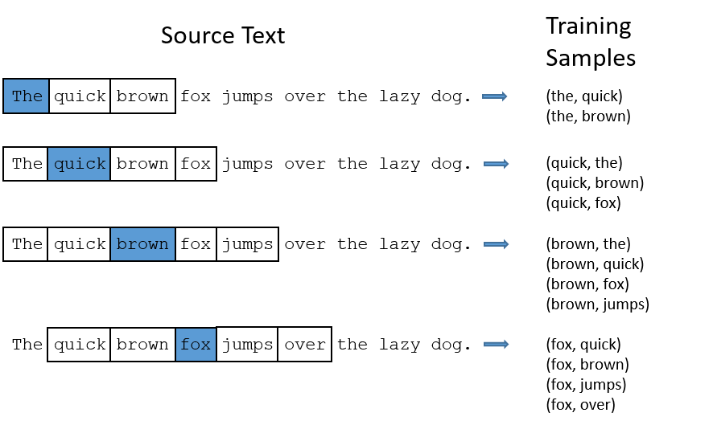

# 🌚 Word Representation

## 🌚 Word Representation

> This document may contain incorrect info 🙄‼ Please open a pull request to fix when you find a one 🌟

* One Hot Encoding
* Featurized Representation \(Word Embedding\)
* Word2Vec
* Skip Gram Model
* GloVe \(Global Vectors for Word Representation\)

## 🚀 One Hot Encoding

A way to represent words so we can treat with them easily

### 🔎 Example

Let's say that we have a dictionary that consists of 10 words \(🤭\) and the words of the dictionary are:

* Car, Pen, Girl, Berry, Apple, Likes, The, And, Boy, Book.

Our $$X^{(i)}$$ is: **The Girl Likes Apple And Berry**

So we can represent this sequence like the following 👀

```text
Car   -0)  ⌈ 0 ⌉   ⌈ 0 ⌉   ⌈ 0 ⌉   ⌈ 0 ⌉  ⌈ 0 ⌉   ⌈ 0 ⌉ 
Pen   -1)  | 0 |  | 0 |  | 0 |  | 0 |  | 0 |  | 0 |
Girl  -2)  | 0 |  | 1 |  | 0 |  | 0 |  | 0 |  | 0 |
Berry -3)  | 0 |  | 0 |  | 0 |  | 0 |  | 0 |  | 1 |
Apple -4)  | 0 |  | 0 |  | 0 |  | 1 |  | 0 |  | 0 |
Likes -5)  | 0 |  | 0 |  | 1 |  | 0 |  | 0 |  | 0 |
The   -6)  | 1 |  | 0 |  | 0 |  | 0 |  | 0 |  | 0 |
And   -7)  | 0 |  | 0 |  | 0 |  | 0 |  | 1 |  | 0 |
Boy   -8)  | 0 |  | 0 |  | 0 |  | 0 |  | 0 |  | 0 |
Book  -9)  ⌊ 0 ⌋   ⌊ 0 ⌋   ⌊ 0 ⌋   ⌊ 0 ⌋  ⌊ 0 ⌋   ⌊ 0 ⌋
```

By representing sequences in this way we can feed our data to neural networks✨

### 🙄 Disadvantage

* If our dictionary consists of 10,000 words so each vector will be 10,000 dimensional 🤕 
* This representation can not capture semantic features 💔

### 🎎 Featurized Representation \(Word Embedding\)

* Representing words by associating them with features such as gender, age, royal, food, cost, size.... and so on 
* Every feature is represented as a range between \[-1, 1\] 
* Thus, every word can be represented as a vector of these features
  * The dimension of each vector is related to the number of features that we pick

#### 🔢 Embedded Matrix

For a given word _w_, the embedding matrix _E_ is a matrix that maps its 1-hot representation $$o_w$$ to its embedding $$e_w$$ as follows:

$$e_w=Eo_w$$

#### 🎀 Advantages

* Words that have the **similar** meaning have a **similar** representation.
* This model can capture semantic features ✨ 
* Vectors are smaller than vectors in one hot representation.

> TODO: Subtracting vectors of oppsite words

### 🔄 Word2Vec

* Word2vec is a strategy to learn word embeddings by estimating the likelihood that a given word is surrounded by other words.
* This is done by making context and target word pairs which further depends on the **window size** we take.
  * **Window size**:  a parameter that looks to the left and right of the context word for as many as window\_size words



> Creating _Context to Target_ pairs with _window size = 2_ 🙌

### Skip Gram Model

The skip-gram word2vec model is a supervised learning task that learns word embeddings by assessing the likelihood of any given target word _t_ happening with a context word _c_. By noting $$θ_{t}$$ a parameter associated with _t_, the probability _P\(t\|c\)_ is given by:

$$P(t|c)=\frac{exp(\theta^T_te_c)}{\sum_{j=1}^{|V|}exp(\theta^T_je_c)}$$

> Remark: summing over the whole vocabulary in the denominator of the softmax part makes this model computationally expensive

#### 🚀 One Hot Rep. vs Word Embedding


### 🧤 GloVe

The GloVe model, short for global vectors for word representation, is a word embedding technique that uses a co-occurence matrix _X_ where each $$X_{ij}$$ denotes the number of times that a target _i_ occurred with a context _j_. Its cost function _J_ is as follows:

$$J(\theta)=\frac{1}{2}\sum_{i,j=1}^{|V|}f(X_{ij})(\theta^T_ie_j+b_i+b'_j-log(X_{ij}))^2$$

where _f_ is a weighting function such that $$X_{ij}=0$$ ⟹ $$f(X_{ij})$$ = 0. Given the symmetry that _e_ and _θ_ play in this model, the final word embedding e $$e^{(final)}_w$$ is given by:

$$e^{(final)}_w=\frac{e_w+\theta_w}{2}$$

### 👩‍🏫 Conclusion of Word Embeddings

* If this is your first try, you should try to download a pre-trained model that has been made and actually works best.
* If you have enough data, you can try to implement one of the available algorithms.
* Because word embeddings are very computationally expensive to train, most ML practitioners will load a pre-trained set of embeddings.

### 🧐 References

* [Recurrent Neural Networks Cheatsheet ✨](https://stanford.edu/~shervine/teaching/cs-230/cheatsheet-recurrent-neural-networks)
* [NLP — Word Embedding & GloVe](https://medium.com/@jonathan_hui/nlp-word-embedding-glove-5e7f523999f6)

