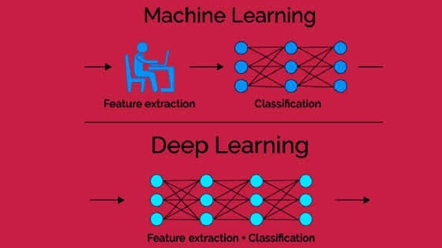

# 👀 Quick Visual Info
This folder contains only viusal materials in order to give lots of information in short time

> Materials will be divided into different files (or categories) as they increase 👮‍

### Types of Machine Learning

### Supervised Learning vs Unsupervised Learning

### Machine Learning vs Deep Learning

### Good Sources That Must Be Followed
* [Instagram AI Machine Learning](https://www.instagram.com/ai_machine_learning/)