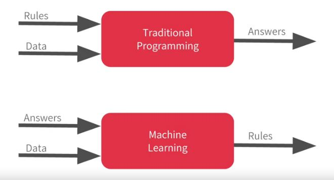

# 🌱 Introduction

Like every first app we should start with something super simple that gives us an idea about the whole methodology.

### ✨ What is Keras?

Keras is a high-level **neural networks API**, written in Python and capable of running on top of TensorFlow, CNTK, or Theano.

### 📚 Important Terms

| Term | Description |
| :--- | :--- |
| Dense | A layer of neurons in a neural network |
| Loss Function | A mathematical way of measuring how wrong your predictions are |
| Optimizer | An algorithm to find parameter values which correspond to minimum value of loss function |

### 👩‍🔬 The Simplest Neural Network

It contains one layer with one neuron.

#### 👩‍💻 Code Example

```python
# initialize the model
model = Sequential()

# add a layer with one unit and set the dimension of input 
model.add(Dense(units=1, input_shape=[1]))

# set functional properties and compile the model
model.compile(optimizer='sgd', loss='mean_squared_error'
```

After building out neural network we can feed it with our sample data 😋

#### 👩‍💻 Code Example

```python
xs = np.array([-1.0,  0.0, 1.0, 2.0, 3.0, 4.0], dtype=float)
ys = np.array([-3.0, -1.0, 1.0, 3.0, 5.0, 7.0], dtype=float)
```

Then we have to start training process 🚀

#### 👩‍💻 Code Example

```python
model.fit(xs, ys, epochs=500)
```

Every thing is done 😎 ! Now we can test our neural network with new data 🎉

#### 👩‍💻 Code Example

```python
print(model.predict([10.0]))
```

### 👩‍💻 My Code

* Full source code is [here 🐾](https://github.com/asmaamirkhan/DeepLearningNotes/tree/990b0a5fd130dafe31655c915eb45c9774b8521f/1-HelloWorld/HelloWorldWithTF.ipynb)
* Tensorflow.js in browser [here 🐾](https://github.com/asmaamirkhan/DeepLearningNotes/tree/990b0a5fd130dafe31655c915eb45c9774b8521f/1-HelloWorld/1-TFJS.html)

### 🔃 Traditional Programming vs Machine Learning

### 🧐 References



* [Official Documentation of Keras](https://keras.io/)
* [More About Sequential model](https://keras.io/getting-started/sequential-model-guide/)
* [More About Optimizers in Keras](https://keras.io/optimizers/)
* [More About Loss Functions in Keras](https://keras.io/losses/)

