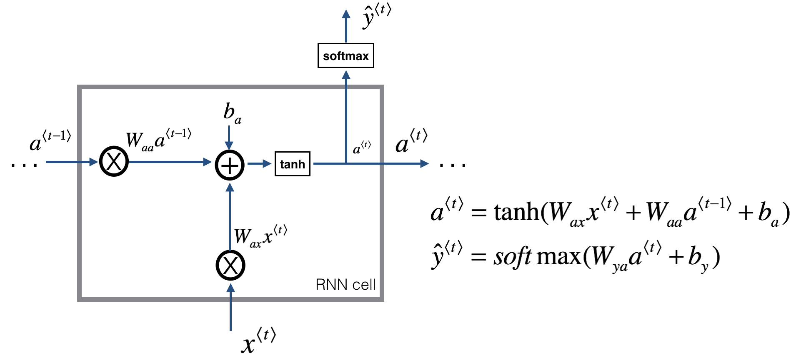
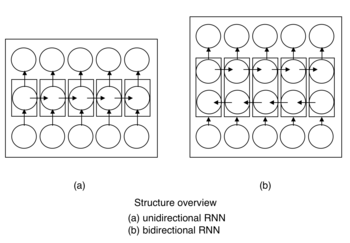
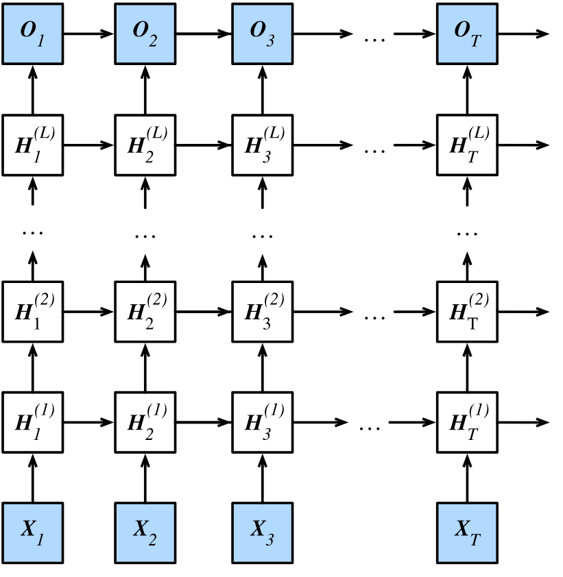

# 🔄 Recurrent Neural Networks

## 🔄 Recurrent Neural Networks

### 🔎 Definition

A class of neural networks that allow previous outputs to be used as inputs to the next layers

> They remember things they learned during training ✨

## 🧱 Architecture

### **🔶 The Whole RNN Architecture**

## **🧩 An RNN Cell**

Basic RNN cell. Takes as input $$x^{⟨t⟩}$$ \(current input\) and $$a^{⟨t−1⟩}$$ \(previous hidden state containing information from the past\), and outputs $$a^{⟨t⟩}$$ which is given to the next RNN cell and also used to predict $$y^{⟨t⟩}$$

#### ⏩ Forward Propagation

**To find** $a^{}$ **:**

$$
a^{}=g(W_{aa}a^{}+W_{ax}x^{}+b_a)
$$

**To find** $\hat{y}^{}$ **:**

$$\hat{y}^{} = g\(W\_{ya}a^{}+b\_y\)$$

**👀 Visualization**

#### ⏪ Back Propagation

**Loss Function is defined like the following**

$$L^{}\(\hat{y}^{}, y^{}\)=-y^{}log\(\hat{y}\)-\(1-y^{}\)log\(1-\hat{y}^{}\)$$

$$L\(\hat{y},y\)=\sum\_{t=1}^{T\_y}L^{}\(\hat{y}^{}, y^{}\)$$

#### 🎨 Types of RNNs

* 1️⃣ ➡ 1️⃣ **One-to-One** \(Traditional ANN\)
* 1️⃣ ➡ 🔢 **One-to-Many** \(Music Generation\)
* 🔢 ➡ 1️⃣ **Many-to-One** \(Semantic Analysis\)
* 🔢 ➡ 🔢 **Many-to-Many** $$T\_x = T\_y$$ \(Speech Recognition\)
* 🔢 ➡ 🔢 **Many-to-Many** $$T\_x \neq T\_y$$ \(Machine Translation\)

### 🔥 Advanced Recurrent Neural Networks

#### 🔄 Bidirectional RNNs \(BRNN\)

* In many applications we want to output a prediction of $$y^{\(t\)}$$ which may depend on the whole input sequence
* Bidirectional RNNs combine an RNN that moves **forward** through time beginning from the start of the sequence with another RNN that moves **backward** through time beginning from the end of the sequence ✨

**💬 In Other Words**

* Bidirectional recurrent neural networks\(RNN\) are really just putting two independent RNNs together.
* The input sequence is fed in normal time order for one network, and in reverse time order for another.
* The outputs of the two networks are usually concatenated at each time step.
* 🎉 This structure allows the networks to have both backward and forward information about the sequence at every time step.

**👎 Disadvantages**

We need the entire sequence of data before we can make prediction anywhere.

> e.g: not suitable for real time speech recognition

**👀 Visualization**

#### 🕸 Deep RNNs

The computation in most RNNs can be decomposed into three blocks of parameters and associated transformations: 1. From the input to the hidden state, $$x^{\(t\)}$$ ➡ $$a^{\(t\)}$$ 2. From the previous hidden state to the next hidden state, $$a^{\(t-1\)}$$ ➡ $$a^{\(t\)}$$ 3. From the hidden state to the output, $$a^{\(t\)}$$ ➡ $$y^{\(t\)}$$

We can use multiple layers for each of the above transformations, which results in deep recurrent networks 😋

**👀 Visualization**

#### ❌ Problem: Vanishing Gradients with RNNs

* An RNN that processes a sequence data with the size of 10,000 time steps, has 10,000 deep layers which is very hard to optimize 🙄
* Same in Deep Neural Networks, deeper networks are getting into the vanishing gradient problem 🥽
* That also happens with RNNs with a long sequence size 🐛

**🧙‍♀️ Solutions**

* Read [Part-2](https://github.com/asmaamirkhan/DeepLearningNotes/tree/d20deec6ead832c6650a0d761212dfafef64b302/9-SequenceModels/2-VanishingGradients.md) for my notes on Vanishing Gradients with RNNs 🤸‍♀️

#### 🧐 Read More

* [Recurrent Neural Networks Cheatsheet ✨](https://stanford.edu/~shervine/teaching/cs-230/cheatsheet-recurrent-neural-networks#)
* [All About RNNs 🚀](https://medium.com/@jianqiangma/all-about-recurrent-neural-networks-9e5ae2936f6e)

