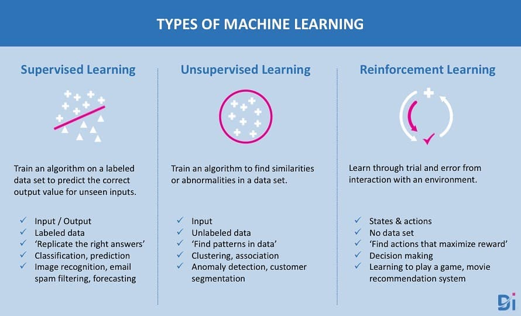
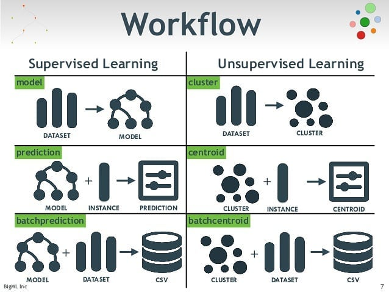

# 👀 Quick Visual Info

This folder contains only viusal materials in order to give lots of information in short time

> Materials will be divided into different files \(or categories\) as they increase 👮‍

## Types of Machine Learning

## Supervised Learning vs Unsupervised Learning

## Machine Learning vs Deep Learning

## Good Sources That Must Be Followed

* [Instagram AI Machine Learning](https://www.instagram.com/ai_machine_learning/)

